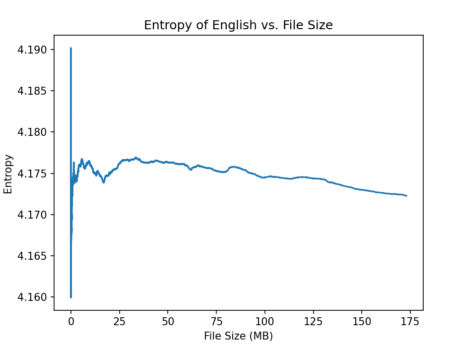
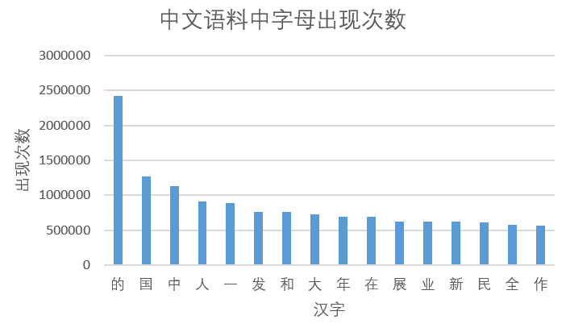

# 计算中英文信息源的熵

<center>
    2021K8009929010 贾城昊
</center>

[TOC]

## 一、报告摘要
本次任务中，我采用python语言，利用BeautifulSoup，re等库进行爬虫、数据清洗和熵计算。
针对中文熵计算，为了得到大量的文本数据，我选择了人民日报的官方网站：人民日报-人民网 (people.com.cn)
针对英文熵计算，选取了人民日报英文版（http://en.people.cn）为主网站。
随后爬取了2021年1月1日至今的中文数据，英文数据则爬取到了2020年1月1日，然后采用正则表达式匹配方法进行数据清洗，最终得到了305.20MB的中文数据和172.98MB的英文数据。最后通过统计分别计算中文熵和英文熵。

## 二、爬取数据
### 1. 中文数据 
为了爬取每天人民日报的数据，每次爬取需要对官网的url进行处理，把其中涉及日期的部分更改为要爬取的日期。而且由于每天的日报会分成不同的模块（最多20个模块），因此需要对每个模块的url发出http请求，每个模块的url有规律，具体来说则是在相同前缀前加上编号和".htm"，故代码处理如下：
```python
    page_links = self.base_urls + self.parseday.isoformat()[:-3] + "/" + self.parseday.isoformat()[8:10] + "/" + "nbs.D110000renmrb_"
    for i in range(1, 21):
        if i < 10:
            url = page_links + "0" + str(i) + ".htm"
        else:
            url = page_links + str(i) + ".htm"
        print("正在爬取新闻主页:", url)
```
每个模块中又会有多个文章，因此需要对每个文章的url发出http请求，具体来说选择class为"news"的div，然后根据下面的a标签得到文章的url，然后获取文章的内容，写进txt文件
```python
div_tags = soup.find_all('div', class_="news")
for div_tag in div_tags:
    try:
        for a_tag in div_tag.find_all("a"):
            prefix_url = self.base_urls + self.parseday.isoformat()[:-3] + "/" + self.parseday.isoformat()[8:10] + "/"
            url_list.append((str(prefix_url + a_tag.get('href')).strip()))  ##得到href
    except:
        continue

url_list = list(set(url_list))  ##去重

with open('ch_content.txt', 'a', encoding='utf-8') as f:
    for news_url in url_list:
        news = self.get_url_text(news_url)
        if news != "":
            f.write(news)
            self.total_web_page += 1
```
具体读取文章内容的代码如下，分别获取标题和正文内容：
```python
title = soup.title.text.strip()  ##获得标题
text += title

div_tags = soup.find_all('div', class_="article")
for div_tag in div_tags:
    try:
        for p_tag in div_tag.find_all("p"):
            text += p_tag.text.strip()  ##得到文本, strip()去除空格
    except:
        continue

return text
```

### 2. 英文数据 
爬取英文数据的流程与爬取中文流程类似，主页的url也具有一定规律
```python
url = self.base_urls + self.parseday.isoformat().replace("-", "") + ".html"
print("正在爬取新闻主页:", url)
```
而查找文章时也类似，只需要修改查找div的class标签即可，然后如果超链接a对应的url不是一篇文章，直接跳过即可。
```python
a_tags = soup.find_all('a')

for a_tag in a_tags:
    try:
        prefix_url = "http://en.people.cn/"
        href = a_tag.get('href')
        if href.find("http") == -1:
            url_list.append((str(prefix_url + a_tag.get('href')).strip()))  ##得到href
    except:
        continue

url_list = list(set(url_list))  ##去重

with open('en_content.txt', 'a', encoding='utf-8') as f:
    for news_url in url_list:
        news = self.get_url_text(news_url)
        if news != "" and news[0] != "4": # not 404
            f.write(news)
            self.total_web_page += 1
```
读取文章内容代码如下，也与中文数据的爬取大致相同（英文版人民日报文章主题的div标签可能有两种）
```python
title = soup.title.text.strip()  ##获得标题
text += title

div_tags = soup.find_all('div', class_="d2txtCon")
if len(div_tags) > 0:
    for div_tag in div_tags:
        try:
            for p_tag in div_tag.find_all("p"):
                text += p_tag.text.strip()  ##得到文本, strip()去除空格
        except:
            continue
else:
    div_tags = soup.find_all('div', class_="wb_12")
    for div_tag in div_tags:
        try:
            for p_tag in div_tag.find_all("p"):
                text += p_tag.text.strip()  ##得到文本, strip()去除空格
        except:
            continue

return text
```

## 三、数据清洗
### 1. 中文数据
由于爬取的数据包含了标点符号等无用信息，因此需要对数据进行筛选。
选择使用python自带的re正则表达库，由于在unicode的编码中 中文的编码范围是[\u4e00-\u9fff]，因此只需要保留这部分数据即可，最后写回文本文件：
```python
with open('ch_content.txt', 'r', encoding='utf-8') as f:
    txt = f.read()
    txt = re.sub(r'[^\u4e00-\u9fa5]+', "", txt)

# 把清洗过的文本写回去
with open('ch_content.txt', 'w', encoding='utf-8') as f:
    f.write(str(txt))
    f.close()
```
经过数据处理后，得到的中文数据文件大小为305.20MB,总字数为106676224

### 2. 英文数据
针对英文文本，与中文类似，利用正则表达式，去除除了英文字母之外的所有字符，将小写字母全部转化为大写字母以便统计，并写回文本文件：
```python
with open('en_content.txt', 'r', encoding='utf-8') as f:
    txt = f.read()
    txt = re.sub('[^A-Za-z]+','',txt)
    txt = txt.upper()

# 把清洗过的文本写回去
with open('en_content.txt', 'w', encoding='utf-8') as f:
    f.write(str(txt))
    f.close()
```
经过数据处理后，得到的英文数据文件大小为172.98MB,总字母数为181388190


## 四、计算熵
分为两个步骤：
### 1. 增加样本规模
我选择了以3KB单位来逐步增加样本规模（英文总文件大小只有172.98MB，所以每次仅仅增加1KB）。
以中文为例，增加规模的方式的代码如下：
```python
record_delta = 1024
if (content_len / record_delta) > record_num:
    print(content_len)
    current_entropy = calculate_entropy(rate, content_len)
    with open("entropy_ch.txt", "a") as fw:
        #一个中文字符大小为3B
        write_str = str((content_len / record_delta) * 3 / 1024) + ":" + str(current_entropy) + "\n"
        fw.write(write_str)
        print("recorded file size : ", (content_len / record_delta) * 3 / 1024, " KB")

    record_num += 1
```

### 2. 计算熵
计算熵的公式如下

​									$H(X)=-\sum_{x \in X} p(x) \log _{2} p(x)$
在读取文本时，用字典存储每个汉字（字母）出现的次数和字符长度然后根据上面的公式计算即可
具体计算熵的代码如下
```python
def calculate_entropy(rate, content_len):
    # 计算熵
    entropy = 0
    for key, value in rate.items():
        entropy += value / content_len * math.log(content_len / value) / math.log(2)

    return entropy
```

## 五、结果展示
### 1. 熵随文件大小变化曲线
利用python的matplotlib库，对于中文，可以得到爬取数据的熵随着文件大小的变化曲线，如下所示：

可以看到，随着规模的增大，中文汉字的熵稳定在9.6附近，且随着样本增大不断平滑，其中全部中文语料计算得到的熵为9.605，一共6849个字。
对于英文，爬取数据的熵随着文件大小的变化曲线，如下所示：

可以看到，随着规模的增大，英文字母的熵稳定在4.17附近，其中全部英文语料计算得到的熵为4.1723，一共26个字母.
PPT上给出的结果为：中文9.71，英文4.03，存在较小的偏差，本人认为可能是由于爬取的语料是从人民日报得到的，所以文章的中文表述较为正式化，出现的词语较为固定，所以熵的计算结果会偏小。而由于英文是从人民日报的英文版本得到的，可能存在较多的专有名词，故英文的熵计算结果会偏大。
另外，查资料可知，汉字的静态平均信息熵是9.65比特，和中文语料所得结果相近。

### 2. 其它结果
全部中文语料的汉字出现次数前10如下所示：

可以看到，出现较多的字大多是人民日报中较为常见的词语的一部分，如“中国”，“发展”，“人民”等。
全部英文语料的字母出现次数前10如下所示：

查资料可知，得到的结果与目前英文语料库中出现频率较高的字母基本一致。