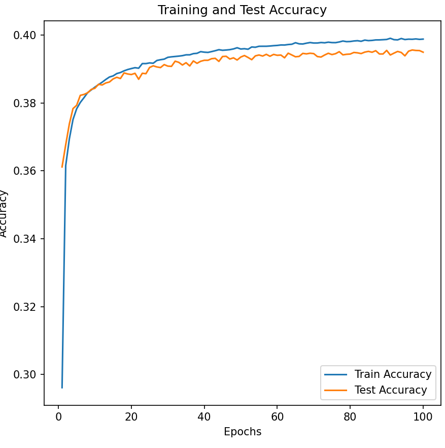
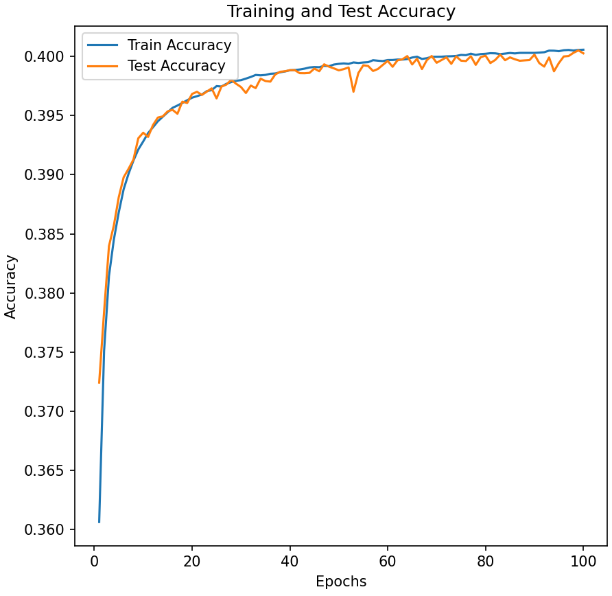
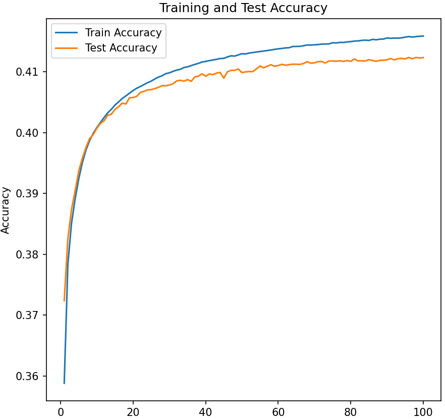
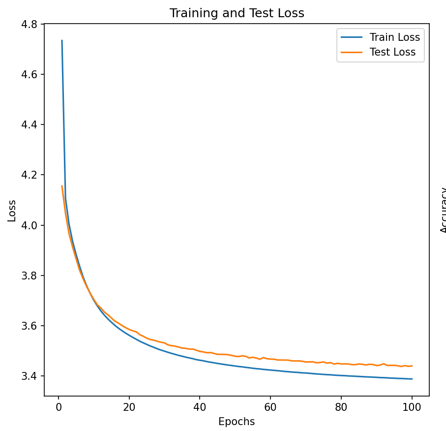
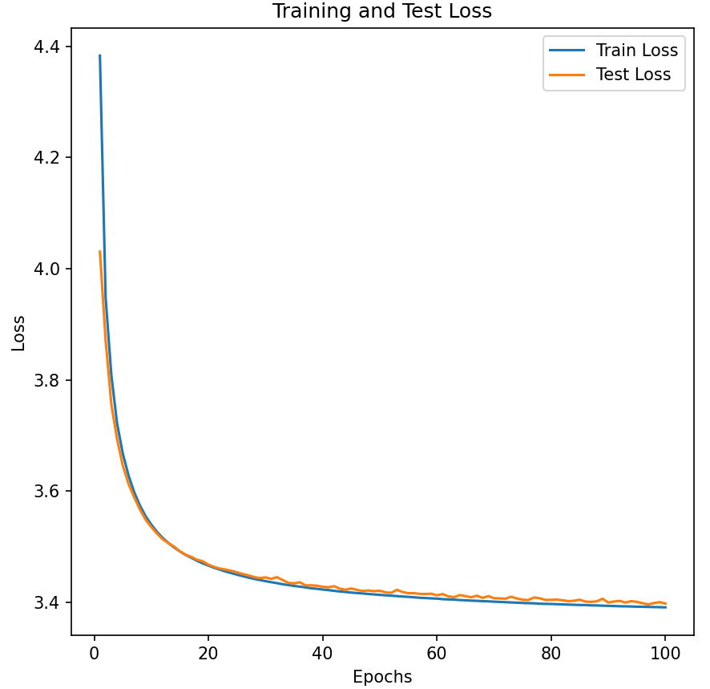
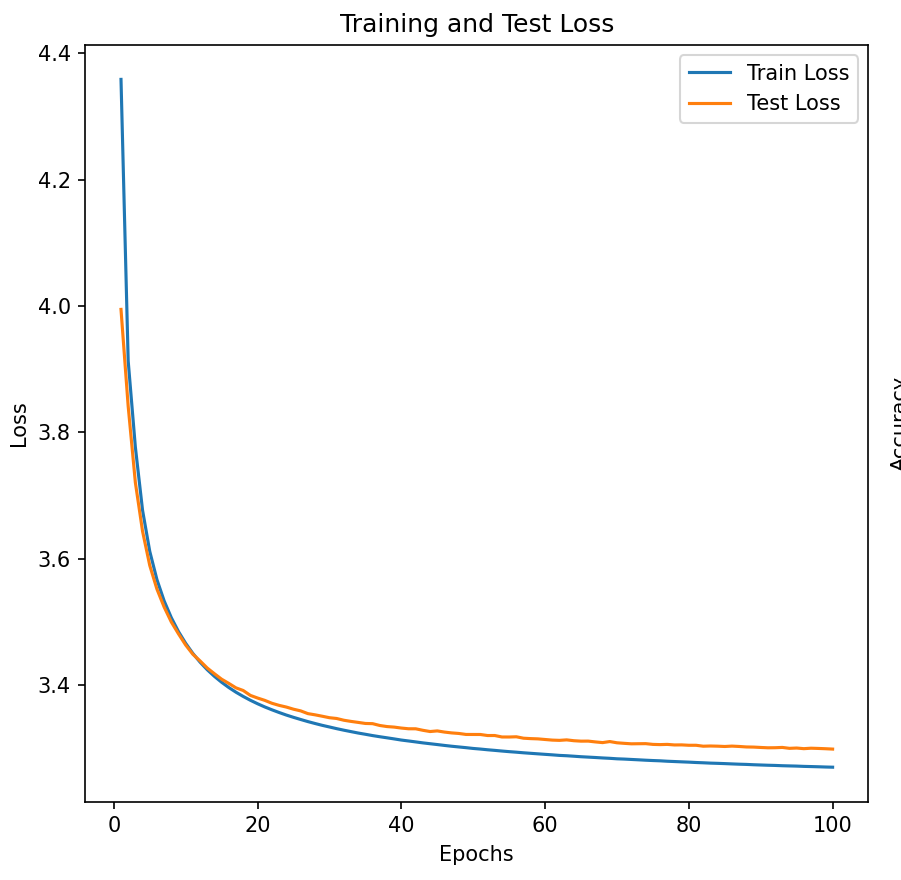

# FNN, RNN, LSTM 词向量对比分析

<center>
    2021K8009929010 贾城昊
</center>

[TOC]

## 一、报告摘要
在北京大学标注的《人民日报》1998年1月份的分词语料库上，分别训练 FNN, RNN, LSTM 三种模型，提取各自学习到的词向量查找表，对比分析这三种模型生成的词向量的差异性。

## 二、数据处理

这部分代码详情请见代码文件`dataset.py`和`dataloader.py`，分别用于构建数据集和为模型训练加载数据 

### 1. 确定词表内容
由于计算资源的限制，在本次实验中，我规定了词表大小为1024，对应与在语料库中出现频率最高的1023个词和一个预留的\<UNK\>。相关的超参数对应于配置文件`config/base.yaml`中的 `vocab_size` 项。
主要利用`Counter`库对分词结果进行词频统计，相关结果存放在词频统计文件 `word_counts.txt`里。

### 2. 制作数据集 
由于FNN模型和RNN/LSTM模型的输入输出不同，且设定的序列长度和词表大小，所对应的数据集也有区别。因此每次训练时会首先进行数据集的构建并保存在`./dataset`文件夹下。而如果之前已经构建过对应的模型，序列长度和词表大小的数据集，则直接加载即可。

FNN模型的输入值为一个长为 `n-1` 的序列，标签值为这个序列的下一个值。而RNN/LSTM的标签值则是一个与输入值相错一位的序列，相关构建数据集代码如下：

```python
class Text_Dataset(Data.Dataset):
    def __init__(self, filename, n_size, vocab_size=1024, encoding="gbk", type="n_gram"):
        self.n_size = n_size
        self.data_process(filename=filename, vocab_size=vocab_size, save=False) #统计得到前vocab_size个词的词频(self.top_words)

        with open(filename, encoding=encoding) as f:
            # used to construct n-gram
            lines = f.readlines()

        x = []
        y = []
        if type == "n_gram":
            # n-gram
            for line in lines:
                words = line.split()
                if len(words) >= n_size:
                    for i in range(len(words) - n_size + 1):
                        x.append([self.top_words.get(word, 0) for word in words[i:i + n_size - 1]])
                        y.append(self.top_words.get(words[i + n_size - 1], 0))
        elif type == "rnn":
            # for rnn and lstm
            for line in lines:
                words = line.split()
                if len(words) >= n_size:
                    for i in range(len(words) - n_size + 1):
                        x.append([self.top_words.get(word, 0) for word in words[i:i + n_size - 1]])
                        y.append([self.top_words.get(word, 0) for word in words[i + 1:i + n_size]])
        else:
            assert False, "Unknown Type"

        self.x_tensor = torch.tensor(x)
        self.y_tensor = torch.tensor(y)

        self.len = len(self.x_tensor)
```

在训练时，每个epoch，会把数据集中随机的80%用作训练集，剩下20%用作数据集。这部分的主要代码如下：

```python
def get_loaders(batch_size=512, valid=0.0, train=0.8, filename="ChineseCorpus199801.txt", n_size=9, vocab_size=1024,
                type="n_gram", encoding="gbk", num_workers=0, pin_memory=False):
    file_path = "./datasets/save_dataset_{0}_{1}_{2}.pth".format(n_size, vocab_size, type)
    if os.path.exists(file_path):
        dataset = torch.load(file_path)
    else:
        dataset = Text_Dataset(filename=filename, n_size=n_size, vocab_size=vocab_size, encoding=encoding, type=type)
        torch.save(dataset, file_path)
    
    train_size = int(train * len(dataset))
    test_size = len(dataset) - train_size
    trainset, testset = Data.random_split(dataset, [train_size, test_size])

    train_sampler, valid_sampler = get_train_valid_sampler(trainset, valid)
    train_loader = Data.DataLoader(trainset,
                              batch_size=batch_size,
                              sampler=train_sampler,
                              num_workers=num_workers,
                              pin_memory=pin_memory)
    
    valid_loader = Data.DataLoader(trainset,
                              batch_size=batch_size,
                              sampler=valid_sampler,
                              num_workers=num_workers,
                              pin_memory=pin_memory)
    
    test_loader = Data.DataLoader(testset,
                             batch_size=batch_size,
                             num_workers=num_workers,
                             pin_memory=pin_memory)
    
    return train_loader, valid_loader, test_loader
```

## 三、模型实现

模型定义保存在`model/models.py`代码文件中

### 1. FNN

输入数据会首先经过一层嵌入层，将输入的 `n` 个词汇序号转换为 `n` 个 `embedding_dim` 维的词向量。这些向量在层归一化后，进行Flatten操作。然后这个向量被送往一个隐藏层大小为 `hidden_size` 的网络，输出一个和词向量同维的向量，作为分类的依据。这个输出的词向量会和嵌入层中的词汇表进行点乘，以计算与各词汇余弦距离，并依此分类。
由于pytorch的交叉熵损失函数中自带了Softmax层，因此模型的最后并没有引入Softmax。代码如下：

```python
class FNN(nn.Module):
    def __init__(self, vocab_size, seq_len, embedding_dim, hidden_size, num_layers):
        super().__init__()
        self.embedding = nn.Embedding(vocab_size, embedding_dim)
        self.norm = nn.LayerNorm(embedding_dim, elementwise_affine=False)
        self.flatten = nn.Flatten()

        input_size = (seq_len - 1) * embedding_dim
        layers = []
        for _ in range(num_layers):
            layers.extend([
                nn.Linear(input_size, hidden_size),
                nn.ReLU()])
            input_size = hidden_size

        layers.extend([
            nn.Linear(hidden_size, embedding_dim),
            nn.ReLU()])

        self.linear_relu_stack = nn.Sequential(*layers)

    def forward(self, x):
        x = self.embedding(x)
        x = self.norm(x)
        x = self.flatten(x)
        x = self.linear_relu_stack(x)
        x = torch.matmul(x, self.embedding.weight.T)

        return x
```

### 2. RNN
RNN的设计与FNN相似。不同的是，`nn.RNN` 层输出 `n` 个不同时刻的隐层向量。在经过线性网络后，和FNN一样被送往与嵌入层的词汇表做点积，以判断这 `n` 个输出各自与不同词汇的相似程度。代码如下：

```python
class RNN(nn.Module):
    def __init__(self, vocab_size, embedding_dim, hidden_size, num_layers):
        super().__init__()
        self.embedding = nn.Embedding(vocab_size, embedding_dim)
        self.norm = nn.LayerNorm(embedding_dim, elementwise_affine=False)
        self.rnns = nn.ModuleList([nn.RNN(embedding_dim if layer == 0 else hidden_size,
                                          hidden_size, batch_first=True) for layer in range(num_layers)])
        self.linear_relu_stack = nn.Sequential(
            nn.Linear(hidden_size, embedding_dim),
            nn.ReLU()
        )

    def forward(self, x):
        x = self.embedding(x)
        x = self.norm(x)

        for rnn in self.rnns:
            x, _ = rnn(x)

        x = self.linear_relu_stack(x)
        x = torch.matmul(x, self.embedding.weight.T)

        return x
```

### 3. LSTM

LSTM的流程设计与RNN几乎一样，代码如下：

```python
class LSTM(nn.Module):
    def __init__(self, vocab_size, embedding_dim, hidden_size, num_layers):
        super().__init__()
        self.embedding = nn.Embedding(vocab_size, embedding_dim)
        self.norm = nn.LayerNorm(embedding_dim, elementwise_affine=False)
        self.lstms = nn.ModuleList([nn.LSTM(embedding_dim if layer == 0 else hidden_size,
                                            hidden_size, batch_first=True) for layer in range(num_layers)])
        self.linear_relu_stack = nn.Sequential(
            nn.Linear(hidden_size, embedding_dim),
            nn.ReLU()
        )

    def forward(self, x):
        x = self.embedding(x)
        x = self.norm(x)

        for lstm in self.lstms:
            x, _ = lstm(x)

        x = self.linear_relu_stack(x)
        x = torch.matmul(x, self.embedding.weight.T)

        return x
```

## 四、实验过程
### 1. 训练与测试过程
为尽量控制变量一致，三个模型均以 `1e-3` 的学习率和 `512` 的 `batch_size`，隐藏层的层数`layer`均为`3`，使用Adam优化器与交叉熵损失，在数据集上训练了共`100`个epoch。
相关配置全部保存在`config/base.yaml`文件中：

```yaml
FNN:
  vocab_size : 1024
  embedding_dim : 16
  n : 9
  hidden_size : 64
  lr : 1.0e-3
  batch_size : 512
  epochs : 100
  layer : 3

RNN:
  vocab_size : 1024
  embedding_dim : 16
  n : 9
  hidden_size : 64
  lr : 1.0e-3
  batch_size : 512
  epochs : 100
  layer : 3

LSTM:
  vocab_size : 1024
  embedding_dim : 16
  n : 9
  hidden_size : 64
  lr : 1.0e-3
  batch_size : 512
  epochs : 100
  layer : 3
```

在训练过程中，会记录下每个epoch的平均loss与预测准确率
每过5个epoch，将自动保存一次模型参数到 `checkpoint/` 文件夹下，按 `<model>-<epoch>.pth` 命名。下次训练时直接读取已保存的模型参数，以加快训练速度。默认时加载epoch最新的模型数据，如下所示（部分代码进行了省略）：

```python
class Model_Pipline():
    def __init__(self, config, device="cuda", load_path=None, row_filename="ChineseCorpus199801.txt"):
        ···
        if load_path is not None:
            if config["model"] == "FNN":
                self.model = FNN(self.vocab_size, self.n, self.embedding_dim, self.hidden_size).load_state_dict(load_path)
                self.type = "FNN"
            elif config["model"] == "RNN":
                self.model = RNN(self.vocab_size, self.embedding_dim, self.hidden_size).load_state_dict(load_path)
                self.type = "RNN"
            elif config["model"] == "LSTM":
                self.model = LSTM(self.vocab_size, self.embedding_dim, self.hidden_size).load_state_dict(load_path)
                self.type = "LSTM"
            else:
                raise Exception("Unknown model type")
        else:
            if config["model"] == "FNN":
                self.model = FNN(self.vocab_size, self.n, self.embedding_dim, self.hidden_size)
                self.type = "FNN"
            elif config["model"] == "RNN":
                self.model = RNN(self.vocab_size, self.embedding_dim, self.hidden_size)
                self.type = "RNN"
            elif config["model"] == "LSTM":
                self.model = LSTM(self.vocab_size, self.embedding_dim, self.hidden_size)
                self.type = "LSTM"
            else:
                raise Exception("Unknown model type")
        ···

    def train_or_eval(self, loss_function, dataloader, optimizer=None, train=False):
        ···
        return avg_loss, correct_rate

    def train(self, optimizer=None, loss_function=None):
        ···
        pth_list = os.listdir("checkpoint")
        latest_pth = None
        cumulative_epoch = 0
        for pth in pth_list:
            if pth.endswith(".pth") and pth.startswith(self.type):
                if latest_pth is None:
                    latest_pth = pth
                else:
                    current_id = int(pth.split("-")[-1].split(".")[0])
                    latest_id = int(latest_pth.split("-")[-1].split(".")[0])
                    if current_id > latest_id:
                        latest_pth = pth
                        cumulative_epoch = current_id

        if latest_pth is not None:
            print("load model from checkpoint/" + latest_pth)
            self.model.load_state_dict(torch.load("checkpoint/" + latest_pth))

        train_losses, train_accuracy, test_losses, test_accuracy = [], [], [], []
        pbar = tqdm(range(self.epochs), desc="Training Progress")
        for _ in pbar:
            train_loss, train_correct = self.train_or_eval(loss_function, train_loader, optimizer, True)
            test_loss, test_correct = self.train_or_eval(loss_function, test_loader)

            train_losses.append(train_loss)
            train_accuracy.append(train_correct)
            test_losses.append(test_loss)
            test_accuracy.append(test_correct)

            # 更新进度条的显示信息
            pbar.set_postfix(train_loss=train_loss, train_accuracy=train_correct,
                             test_loss=test_loss, test_accuracy=test_correct)

            cumulative_epoch += 1
            if cumulative_epoch % 5 == 0:
                if not os.path.exists('checkpoint'):
                    os.makedirs('checkpoint')
                torch.save(self.model.state_dict(), f'./checkpoint/{config["model"]}-' + str(cumulative_epoch) + '.pth')

        pbar.close()
        return train_losses, train_accuracy, test_losses, test_accuracy

    def test(self, dataloader=None, loss_function=None):
        pth_list = os.listdir("checkpoint")
        latest_pth = None
        for pth in pth_list:
            if pth.endswith(".pth") and pth.startswith(self.type):
                if latest_pth is None:
                    latest_pth = pth
                else:
                    current_id = int(pth.split("-")[-1].split(".")[0])
                    latest_id = int(latest_pth.split("-")[-1].split(".")[0])
                    if current_id > latest_id:
                        latest_pth = pth

        if latest_pth is not None:
            print("load model from checkpoint/" + latest_pth)
            self.model.load_state_dict(torch.load("checkpoint/" + latest_pth))
        ···
```

模型的训练和测试代码在`main.py`中，可以通过添加参数进行对应的配置：
```python
if __name__ == "__main__":
    parser = argparse.ArgumentParser(description='The setting of different models')
    parser.add_argument('--model', type=str, default='LSTM', help='model name(FNN, RNN, LSTM)')
    parser.add_argument('--train', type=str, default=False, help='train or not')
    parser.add_argument('--config', type=str, default="./config/base.yaml", help='config file')
    parser.add_argument('--device', type=str, default="cuda", help='the device to train or test the model')
    args = parser.parse_args()
```

## 五. 实验结果
### 1. Loss与Accuracy

训练结果如下所示（横坐标均为epoch；Accuracy和Loss均按FNN、RNN、LSTM的顺序排序）：

<center>


图1 - FNN Accuracy


图2 - RNN Accuracy


图3 - LSTM Accuracy


图4 - FNN Loss


图5 - RNN Loss


图6 - LSTM Loss

</center>

取训练100个epoach后的模型，在整个数据集上进行测试，得到的最终结果如下：

| 模型 | Accuracy | Avg Loss |
| --- | --- | --- |
| FNN | 39.8% | 3.390158 |
| RNN | 40.1% | 3.388824 |
| LSTM | 41.6% | 3.271292  |

可以看到，无论是Accuracy还是Loss，LSTM均优于RNN和FNN，这与理论结果一致。

RNN的Accuracy和Loss也均略优于FNN，但差距相对而言不是很大。

此外，从上面的曲线图可以看到，LSTM的loss收敛速度快于RNN快于FNN。且在训练的后期，LSTM的波动明显比RNN和FNN小

### 2. 词向量分析
我们这次实验的目的是提取三种模型学习到的词向量查找表，对比分析这三种模型生成的词向量的差异性。词向量的获取可以直接通过模型embedding层的weight矩阵进行计算。

```python
    lookup_table = torch.load("checkpoint/" + latest_pth)['embedding.weight'].cpu().numpy()
```

同时为了直观感受词向量学习的有效性，我还选取了一些词语查找与其最相近的10个词，并进行了分析。

相关代码在 `analysis.py`，可以通过参数配置是否随机选取词语进行测试。\

```python
parser = argparse.ArgumentParser(description='The setting of word embedding analysis')
    parser.add_argument('--random', type=bool, default=True, help='random word or not')
    parser.add_argument('--words_lst', type=str, nargs='+', default=["５/m", "虽然/c", "天/q"], help='if not random, get the words analysed')
    args = parser.parse_args()
```

计算相似度的代码如下所示：

```python
def get_similar_wordidx(lookup_table, word_idx):
    word_vec = lookup_table[word_idx]

    normed_lookup_table = lookup_table / np.linalg.norm(lookup_table, axis=1).reshape((-1, 1))
    normed_word_vec = word_vec / np.linalg.norm(word_vec)
    similarity = np.dot(normed_lookup_table, normed_word_vec)

    order = np.argsort(-similarity)

    return order, similarity
```

为了验证模型有效性，我首先主动选了几个词进行测试，部分结果如下：

#### 天/q
```plain
天/q
top 10 similar words in FNN：
0 : 天/q 1.0
1 : 段/q 0.84318924
2 : 岁/q 0.84268785
3 : 次/q 0.77036375
4 : 台/q 0.76740664
5 : 时/Ng 0.7631552
6 : 分/q 0.75822663
7 : 部分/n 0.7068478
8 : 后/f 0.69644946
9 : 张/q 0.6769986
top 10 similar words in RNN：
0 : 天/q 1.0000001
1 : 支/q 0.8002268
2 : 年/q 0.76777244
3 : 种/q 0.7643901
4 : 名/q 0.76316917
5 : 次/q 0.7613845
6 : 位/q 0.7478336
7 : 场/q 0.7325769
8 : 部/q 0.7297036
9 : 条/q 0.7226458
top 10 similar words in LSTM：
0 : 天/q 1.0000001
1 : 年/q 0.87140214
2 : 项/q 0.7253498
3 : 次/q 0.71878994
4 : 张/q 0.69989216
5 : 国/n 0.6967032
6 : 分/q 0.6951072
7 : 场/q 0.6928456
8 : 位/q 0.6734312
9 : 部/q 0.6578542
```

可以看到，与`天`词向量相近的前10个词，三个模型都给出的结果大部分都是与其相同词性的词，可以看出模型是有效的，且LSTM学习到了`年`与`天`的相似性更大。

#### 发展/v
```plain
发展/v
top 10 similar words in FNN：
0 : 发展/v 1.0
1 : 稳定/v 0.81169564
2 : 保护/v 0.78035486
3 : 开发/v 0.77759403
4 : 扩大/v 0.758939
5 : 投入/v 0.741279
6 : 建立/v 0.7407716
7 : 保持/v 0.7323752
8 : 培养/v 0.73196274
9 : 力度/n 0.71039635
top 10 similar words in RNN：
0 : 发展/v 1.0
1 : 支持/v 0.8460387
2 : 推进/v 0.73425025
3 : 改善/v 0.70818037
4 : 关心/v 0.70307255
5 : 稳定/v 0.69693094
6 : 增强/v 0.6914469
7 : 经营/v 0.6901229
8 : 直接/ad 0.6705905
9 : 深化/v 0.6539422
top 10 similar words in LSTM：
0 : 发展/v 1.0
1 : 生产/v 0.7810796
2 : 扩大/v 0.7285459
3 : 开展/v 0.72266716
4 : 实施/v 0.7146526
5 : 推进/v 0.6970169
6 : 完善/v 0.68352026
7 : 调整/v 0.66327703
8 : 资金/n 0.6587618
9 : 开发/v 0.6578261
```

可以看到，与`发展`词向量相近的前10个词，三个模型都给出的结果大部分都是与其相同词性的词，且大部分都是与之一样是正面的词，可以看出模型是有效的。

然后，我按照实验要求，随机选择20个单词，对于这三个模型分别计算与其词向量最相似的前10个单词。结果过长，我放在了附录。这里选取几组进行分析：

#### 胡/nr

```plain
胡/nr
top 10 similar words in FNN：
0 : 胡/nr 0.9999999
1 : 孙/nr 0.968928
2 : 徐/nr 0.95267355
3 : 陈/nr 0.95093626
4 : 李/nr 0.94596815
5 : 马/nr 0.93840045
6 : 王/nr 0.93791074
7 : 罗/nr 0.936463
8 : 刘/nr 0.9273602
9 : 朱/nr 0.926296
top 10 similar words in RNN：
0 : 胡/nr 1.0
1 : 孙/nr 0.9797958
2 : 罗/nr 0.95604396
3 : 赵/nr 0.95246243
4 : 刘/nr 0.92096674
5 : 林/nr 0.9152623
6 : 朱/nr 0.9083111
7 : 马/nr 0.90051144
8 : 王/nr 0.89811593
9 : 陈/nr 0.88606566
top 10 similar words in LSTM：
0 : 胡/nr 1.0
1 : 张/nr 0.96373624
2 : 李/nr 0.9266405
3 : 刘/nr 0.9170203
4 : 杨/nr 0.9148544
5 : 林/nr 0.90797925
6 : 赵/nr 0.9019469
7 : 陈/nr 0.90174186
8 : 吴/nr 0.8944423
9 : 黄/nr 0.8922739
```

可以看到，三个模型清一色匹配了人名，说明这些词的作用和地位比较相似。

#### 泰国/ns

```plain
泰国/ns
top 10 similar words in FNN：
0 : 泰国/ns 0.99999994
1 : 东南亚/ns 0.77399516
2 : 体育/n 0.7682891
3 : 整个/b 0.7533525
4 : 基层/n 0.74462795
5 : 欧洲/ns 0.74245226
6 : 世界/n 0.71865666
7 : 家庭/n 0.7081249
8 : 现代/t 0.69643134
9 : 当地/s 0.68718696
top 10 similar words in RNN：
0 : 泰国/ns 1.0
1 : 中央/n 0.91290426
2 : 德国/ns 0.9041855
3 : 韩国/ns 0.8787954
4 : 上海/ns 0.87385064
5 : 美国/ns 0.85724115
6 : [美国/ns 0.83835846
7 : 联合国/nt 0.8291379
8 : 全省/n 0.827034
9 : [中国/ns 0.8093718
top 10 similar words in LSTM：
0 : 泰国/ns 1.0
1 : 美国/ns 0.85324574
2 : 伊拉克/ns 0.808883
3 : 俄罗斯/ns 0.796913
4 : 我国/n 0.7923859
5 : 俄/j 0.76994103
6 : [中国/ns 0.76091015
7 : 欧洲/ns 0.7511225
8 : 首都/n 0.7335141
9 : 南非/ns 0.7313969
```

可以看到，三个模型匹配到的词元大多都是国家或者与泰国相关的事物。同时可以看到，FNN的匹配结果中含有`整个/b`，`基层/n`这种不太相关的词，而RNN则出现这种情况较少，LSTM则更少，可以看出LSTM在一定程度上比RNN和FNN学习到的词向量更加合理。


## 六、文件结构

```plain
.
├── analysis.py                                             # 词向量分析代码文件
├── checkpoint                                              # 训练结果*
│   ├── FNN-5.pth
│   ├── ...
│   ├── FNN-100.pth
│   ├── LSTM-5.pth
│   ├── ...
│   ├── LSTM-100.pth
│   ├── RNN-5.pth
│   ├── ...
│   └── RNN-100.pth
├── ChineseCorpus199801.txt                                 # 语料库*
├── config                                                  # 配置文件夹
│   └── base.yaml                                           
├── datasets                                                # 构建的数据集*
│   ├── save_dataset_9_1024_n_gram.pth                      # 经加工的数据集，供FNN使用*
│   └── save_dataset_9_1024_rnn.pth                         # 经加工的数据集，供RNN、LSTM使用*
├── dataset.py                                              # 数据集构建代码
├── dataloader.py                                           # 数据集加载代码（测试集与训练集划分）
├── model                                                   
│   └── models.py                                           # 模型定义代码
├── main.py                                                 # 模型的训练和测试的代码与结果可视化
├── 技术报告.pdf
├── result.txt                                              # 词向量分析结果*
└── word_counts.txt                                         # 词频统计结果*
```

注：带有*号的文件为程序运行的结果，由于助教表示不要提交数据集，所以部分文件没有提交，如果需要，可以去
[我的github仓库](https://github.com/Jia040223/NLP)：https://github.com/Jia040223/NLP上下载。


## 附录
### 相似单词匹配结果

```plain
----------------------------------
水/n
top 10 similar words in FNN：
0 : 水/n 1.0
1 : 家/n 0.8157904
2 : 想/v 0.73344195
3 : 面积/n 0.7109102
4 : 此/r 0.67335874
5 : 我/r 0.67130375
6 : 观众/n 0.66644156
7 : 一起/s 0.66060245
8 : 有的/r 0.6463853
9 : 经验/n 0.6437653
top 10 similar words in RNN：
0 : 水/n 1.0
1 : 王/nr 0.65300477
2 : 第二/m 0.6460088
3 : 手/n 0.64166963
4 : 你/r 0.6405257
5 : 大家/r 0.6328484
6 : 了/y 0.6257111
7 : 他们/r 0.6223959
8 : 我/r 0.6159096
9 : 一/m 0.60885257
top 10 similar words in LSTM：
0 : 水/n 1.0
1 : 家/n 0.7323073
2 : 高/a 0.7258605
3 : 点/q 0.71389985
4 : 人物/n 0.6730069
5 : 大/a 0.6575966
6 : 小/a 0.62998575
7 : 条/q 0.60366404
8 : 见/v 0.59191895
9 : 十/m 0.5864906
----------------------------------
直接/ad
top 10 similar words in FNN：
0 : 直接/ad 1.0
1 : 分别/d 0.70663357
2 : 先后/d 0.68971014
3 : 认真/ad 0.67161524
4 : 均/d 0.654726
5 : 而且/c 0.6472902
6 : 创造/v 0.6217786
7 : 继续/v 0.60882413
8 : 更/d 0.60620403
9 : 而是/c 0.60129297
top 10 similar words in RNN：
0 : 直接/ad 1.0
1 : 逐步/d 0.856192
2 : 增强/v 0.8098506
3 : 重新/d 0.7581178
4 : 不断/d 0.72253466
5 : 提高/v 0.71357644
6 : 投入/v 0.7098415
7 : 真正/d 0.699754
8 : 积极/ad 0.69118667
9 : 充分/ad 0.6883919
top 10 similar words in LSTM：
0 : 直接/ad 1.0000001
1 : 共同/d 0.8078673
2 : 充分/ad 0.75081813
3 : 完全/ad 0.7027022
4 : 相/d 0.695575
5 : 持续/vd 0.6307338
6 : 选手/n 0.62920374
7 : 约/d 0.62865835
8 : 成为/v 0.6249173
9 : 仍/d 0.5802506
----------------------------------
人才/n
top 10 similar words in FNN：
0 : 人才/n 1.0
1 : 知识/n 0.93716604
2 : 环境/n 0.8667878
3 : 风险/n 0.85261774
4 : 需求/n 0.84928095
5 : 信息/n 0.8349899
6 : 业务/n 0.8338697
7 : 文化/n 0.80029225
8 : 形势/n 0.7969874
9 : 体系/n 0.79353
top 10 similar words in RNN：
0 : 人才/n 1.0
1 : 思想/n 0.88721645
2 : 力量/n 0.88224953
3 : 方针/n 0.8475588
4 : 制度/n 0.83855045
5 : 法律/n 0.808012
6 : 知识/n 0.803685
7 : 手段/n 0.7994319
8 : 领导/vn 0.79854274
9 : 理论/n 0.79091686
top 10 similar words in LSTM：
0 : 人才/n 1.0
1 : 力量/n 0.82451344
2 : 知识/n 0.7932173
3 : 规模/n 0.79291594
4 : 效益/n 0.792274
5 : 素质/n 0.7466047
6 : 同时/n 0.7418305
7 : 范围/n 0.7345154
8 : 落实/v 0.7313446
9 : 法律/n 0.7266892
----------------------------------
通过/v
top 10 similar words in FNN：
0 : 通过/v 1.0
1 : 作/v 0.8442091
2 : 进行/v 0.840852
3 : 提供/v 0.8172238
4 : 发表/v 0.7946421
5 : 取得/v 0.7855161
6 : 得到/v 0.77658206
7 : 出席/v 0.7654401
8 : 成立/v 0.7470268
9 : 举办/v 0.73389316
top 10 similar words in RNN：
0 : 通过/v 1.0
1 : 组织/v 0.7738168
2 : 举办/v 0.7232084
3 : 向/p 0.684268
4 : 小组/n 0.67030597
5 : 宣布/v 0.6453379
6 : 正式/ad 0.6306803
7 : 会见/v 0.62330765
8 : 介绍/v 0.62192786
9 : 人员/n 0.6190519
top 10 similar words in LSTM：
0 : 通过/v 0.9999999
1 : 成立/v 0.88485396
2 : 发表/v 0.79981595
3 : 最近/t 0.79128474
4 : 参加/v 0.7749978
5 : 组成/v 0.77461505
6 : 协会/n]nt 0.7617586
7 : 进行/v 0.75938225
8 : 正式/ad 0.7497175
9 : 超过/v 0.6776901
----------------------------------
胡/nr
top 10 similar words in FNN：
0 : 胡/nr 0.9999999
1 : 孙/nr 0.968928
2 : 徐/nr 0.95267355
3 : 陈/nr 0.95093626
4 : 李/nr 0.94596815
5 : 马/nr 0.93840045
6 : 王/nr 0.93791074
7 : 罗/nr 0.936463
8 : 刘/nr 0.9273602
9 : 朱/nr 0.926296
top 10 similar words in RNN：
0 : 胡/nr 1.0
1 : 孙/nr 0.9797958
2 : 罗/nr 0.95604396
3 : 赵/nr 0.95246243
4 : 刘/nr 0.92096674
5 : 林/nr 0.9152623
6 : 朱/nr 0.9083111
7 : 马/nr 0.90051144
8 : 王/nr 0.89811593
9 : 陈/nr 0.88606566
top 10 similar words in LSTM：
0 : 胡/nr 1.0
1 : 张/nr 0.96373624
2 : 李/nr 0.9266405
3 : 刘/nr 0.9170203
4 : 杨/nr 0.9148544
5 : 林/nr 0.90797925
6 : 赵/nr 0.9019469
7 : 陈/nr 0.90174186
8 : 吴/nr 0.8944423
9 : 黄/nr 0.8922739
----------------------------------
给/v
top 10 similar words in FNN：
0 : 给/v 1.0000001
1 : 干/v 0.85493255
2 : 进/v 0.82054454
3 : 在/v 0.7929567
4 : 上/v 0.74576074
5 : 去/v 0.72886735
6 : 开/v 0.7210541
7 : 起/v 0.71417546
8 : 准备/v 0.70410424
9 : 住/v 0.69281673
top 10 similar words in RNN：
0 : 给/v 1.0
1 : 到/v 0.7664014
2 : 上/v 0.76238674
3 : 知道/v 0.7480847
4 : 给/p 0.7441474
5 : 至/v 0.7015888
6 : 下/v 0.66672397
7 : 深入/v 0.6605233
8 : 获得/v 0.6598966
9 : 开/v 0.6597319
top 10 similar words in LSTM：
0 : 给/v 0.9999999
1 : 在/v 0.81747663
2 : 出/v 0.7601639
3 : 上/v 0.7212804
4 : 像/v 0.6985308
5 : 进/v 0.695309
6 : 住/v 0.69406724
7 : 受/v 0.685205
8 : 到/v 0.6689391
9 : 获得/v 0.6566873
----------------------------------
其琛/nr
top 10 similar words in FNN：
0 : 其琛/nr 1.0
1 : 党中央/nt 0.8162128
2 : 专家/n 0.7405951
3 : 报告/n 0.7131171
4 : 学者/n 0.7112107
5 : 台湾/ns 0.66322935
6 : 省/n 0.6575475
7 : 亚洲/ns 0.64979
8 : 伊拉克/ns 0.64577425
9 : 商品/n 0.64397955
top 10 similar words in RNN：
0 : 其琛/nr 1.0
1 : 总理/n 0.7409394
2 : 俄罗斯/ns 0.6532051
3 : 鹏/nr 0.6270578
4 : 内部/f 0.5905704
5 : 日前/t 0.58375794
6 : 近日/t 0.56453586
7 : 以色列/ns 0.5234691
8 : 基金/n 0.5175153
9 : 近年来/l 0.5168893
top 10 similar words in LSTM：
0 : 其琛/nr 1.0
1 : 国/n 0.7016302
2 : 应当/v 0.6407232
3 : 机关/n 0.57609653
4 : 项/q 0.57089186
5 : 虽然/c 0.54596716
6 : 只有/c 0.53895295
7 : 摄/Vg 0.53813756
8 : 地/n 0.511528
9 : 克林顿/nr 0.5095074
----------------------------------
外国/n
top 10 similar words in FNN：
0 : 外国/n 1.0
1 : 德国/ns 0.82522285
2 : 法国/ns 0.8217056
3 : 电视/n 0.8096091
4 : 读者/n 0.8008365
5 : 交通/n 0.7957347
6 : 八/m 0.7922808
7 : 贫困/a 0.78889406
8 : 日本/ns 0.7831179
9 : 老/a 0.76653796
top 10 similar words in RNN：
0 : 外国/n 1.0000001
1 : 学生/n 0.8716911
2 : 国内/s 0.8330401
3 : 全市/n 0.8249546
4 : 国际/n 0.7915529
5 : 首都/n 0.7832613
6 : 大型/b 0.7685045
7 : 亚洲/ns 0.7373527
8 : 台湾/ns 0.7364806
9 : 广大/b 0.72842354
top 10 similar words in LSTM：
0 : 外国/n 1.0
1 : 老/a 0.76627296
2 : 党/n 0.76397145
3 : [中国/ns 0.7523637
4 : 现代/t 0.74609935
5 : 青年/n 0.72118837
6 : 有关/vn 0.7041022
7 : 本/r 0.69577074
8 : 地震/n 0.68863964
9 : 教师/n 0.687068
----------------------------------
[人民/n
top 10 similar words in FNN：
0 : [人民/n 1.0000001
1 : 周/nr 0.8757012
2 : 江/nr 0.7868118
3 : 刘/nr 0.78457904
4 : 何/nr 0.7717672
5 : 李/nr 0.74616235
6 : 钱/nr 0.7402391
7 : 医院/n 0.7211532
8 : 罗/nr 0.72000235
9 : 杨/nr 0.71642256
top 10 similar words in RNN：
0 : [人民/n 1.0000001
1 : [北京/ns 0.7279909
2 : 医院/n 0.7139244
3 : 接受/v 0.69156337
4 : 省/n 0.66121113
5 : 全省/n 0.6382361
6 : 农民/n 0.62978977
7 : 驻/v 0.6213522
8 : 京/j 0.62026817
9 : 中央/n 0.60488844
top 10 similar words in LSTM：
0 : [人民/n 1.0
1 : 何/nr 0.71998364
2 : 英国/ns 0.71997225
3 : [国家/n 0.7092692
4 : 伊拉克/ns 0.68082654
5 : 徐/nr 0.67010355
6 : 国际/n 0.66334
7 : 法国/ns 0.6596401
8 : [中共中央/nt 0.65910465
9 : 王/nr 0.6391818
----------------------------------
机构/n
top 10 similar words in FNN：
0 : 机构/n 1.0
1 : 危机/n 0.90000916
2 : 活动/vn 0.7947102
3 : 成员/n 0.78607076
4 : 系统/n 0.7739056
5 : 案件/n 0.7510309
6 : 队伍/n 0.7504174
7 : 战略/n 0.7116195
8 : 集团/n]nt 0.7079555
9 : 建设/vn 0.7027403
top 10 similar words in RNN：
0 : 机构/n 0.99999994
1 : 系统/n 0.8249582
2 : 体系/n 0.74516106
3 : 投资/vn 0.7430614
4 : 环境/n 0.73769546
5 : 中心/n 0.7375377
6 : 方法/n 0.7361468
7 : 资源/n 0.7278131
8 : 政策/n 0.7212318
9 : 基金/n 0.71475834
top 10 similar words in LSTM：
0 : 机构/n 1.0
1 : 危机/n 0.69590306
2 : 与/c 0.68388134
3 : 合作/vn 0.66813254
4 : 体系/n 0.661401
5 : 设备/n 0.659989
6 : 内部/f 0.65475583
7 : 基金/n 0.64478815
8 : 集团/n 0.60835683
9 : 责任/n 0.59919655
----------------------------------
同时/n
top 10 similar words in FNN：
0 : 同时/n 1.0
1 : 时候/n 0.8399697
2 : 规定/n 0.73996603
3 : 现象/n 0.68957305
4 : 案件/n 0.6866013
5 : 特点/n 0.68207467
6 : 要求/n 0.66739416
7 : 机会/n 0.66638863
8 : 影响/vn 0.66473013
9 : 目的/n 0.6599742
top 10 similar words in RNN：
0 : 同时/n 1.0
1 : 观念/n 0.806839
2 : 努力/an 0.7807779
3 : 之后/f 0.7165674
4 : 条件/n 0.7099092
5 : 原则/n 0.7025622
6 : 理论/n 0.70140004
7 : 特点/n 0.6747832
8 : 时间/n 0.66312516
9 : 力量/n 0.6596376
top 10 similar words in LSTM：
0 : 同时/n 1.0
1 : 结果/n 0.76799875
2 : 人才/n 0.7418305
3 : 机会/n 0.72300273
4 : 医院/n 0.7140611
5 : 原则/n 0.708146
6 : 变化/vn 0.703907
7 : 精神/n 0.68726313
8 : 报告/n 0.6805302
9 : 过程/n 0.6750016
----------------------------------
可能/v
top 10 similar words in FNN：
0 : 可能/v 0.99999994
1 : 应/v 0.83497477
2 : 能/v 0.7989049
3 : 则/c 0.78742105
4 : 会/v 0.7645186
5 : 将/d 0.7425788
6 : 大/d 0.7249241
7 : 则/d 0.71494806
8 : 仍/d 0.6771168
9 : 只/d 0.6693145
top 10 similar words in RNN：
0 : 可能/v 1.0
1 : 能/v 0.8763503
2 : 完全/ad 0.82211614
3 : 需要/v 0.7442343
4 : 变/v 0.71850216
5 : 感到/v 0.701933
6 : 长期/d 0.6959184
7 : 打/v 0.66186273
8 : 造成/v 0.6617453
9 : 吃/v 0.65623695
top 10 similar words in LSTM：
0 : 可能/v 1.0
1 : 能/v 0.86028636
2 : 会/v 0.73530006
3 : 太/d 0.6919232
4 : 非常/d 0.6644203
5 : 有人/r 0.65281296
6 : 像/v 0.6511924
7 : 速度/n 0.6496638
8 : 就业/v 0.64708537
9 : 表现/v 0.64329046
----------------------------------
４/m
top 10 similar words in FNN：
0 : ４/m 0.9999999
1 : ５/m 0.972947
2 : ３/m 0.9707536
3 : １０/m 0.9286543
4 : ８/m 0.90486276
5 : ７/m 0.88091344
6 : ２０/m 0.8710714
7 : ２/m 0.8694038
8 : １/m 0.8646906
9 : ６/m 0.8572853
top 10 similar words in RNN：
0 : ４/m 1.0000001
1 : ６/m 0.9456692
2 : ２/m 0.87122786
3 : ７/m 0.8449808
4 : ２０/m 0.81373185
5 : 十/m 0.70189035
6 : 约/d 0.6816007
7 : 几/m 0.67610943
8 : １００/m 0.6756828
9 : 创作/vn 0.62891525
top 10 similar words in LSTM：
0 : ４/m 1.0
1 : ３/m 0.95930326
2 : ５/m 0.9501082
3 : １０/m 0.9381194
4 : ８/m 0.92295855
5 : ３０/m 0.90849507
6 : ５０/m 0.9067919
7 : ７/m 0.9036252
8 : ６/m 0.8614012
9 : 十/m 0.8408203
----------------------------------
市民/n
top 10 similar words in FNN：
0 : 市民/n 1.0
1 : 官兵/n 0.88545203
2 : 产品/n 0.7858498
3 : 统一/vn 0.76245236
4 : 人口/n 0.761116
5 : 读者/n 0.7564775
6 : 民族/n 0.72175914
7 : 地区/n 0.72074306
8 : 干部/n 0.719038
9 : 各/r 0.71108496
top 10 similar words in RNN：
0 : 市民/n 1.0000001
1 : 新春/t 0.7714892
2 : 人类/n 0.7367356
3 : 部队/n 0.72822016
4 : 台湾/ns 0.7254367
5 : 电话/n 0.7129756
6 : 观众/n 0.7007114
7 : 读者/n 0.6978458
8 : 学生/n 0.6829844
9 : 欧洲/ns 0.67772603
top 10 similar words in LSTM：
0 : 市民/n 1.0
1 : 学生/n 0.9097854
2 : 观众/n 0.7805934
3 : 读者/n 0.77882856
4 : 地方/n 0.7553947
5 : 农民/n 0.7402559
6 : 官兵/n 0.73488665
7 : 妇女/n 0.6905817
8 : 教师/n 0.67997795
9 : 行业/n 0.66117525
----------------------------------
条/q
top 10 similar words in FNN：
0 : 条/q 1.0
1 : 件/q 0.85536104
2 : 书/n 0.7755463
3 : 主要/b 0.70489013
4 : 批/q 0.70376134
5 : 系列/q 0.70029724
6 : 最高/a 0.6735018
7 : 电子/n 0.66255337
8 : 点/q 0.65304214
9 : 部/q 0.64992154
top 10 similar words in RNN：
0 : 条/q 1.0
1 : 支/q 0.9328532
2 : 座/q 0.92184716
3 : 场/q 0.9010036
4 : 位/q 0.8902844
5 : 份/q 0.8888269
6 : 部/q 0.8824645
7 : 台/q 0.8748759
8 : 段/q 0.8450202
9 : 件/q 0.83955026
top 10 similar words in LSTM：
0 : 条/q 1.0000001
1 : 种/q 0.9267515
2 : 份/q 0.8915839
3 : 件/q 0.8891729
4 : 支/q 0.8344047
5 : 座/q 0.81170017
6 : 部/q 0.76378846
7 : 张/q 0.7383046
8 : 台/q 0.7172364
9 : 批/q 0.68060946
----------------------------------
出来/v
top 10 similar words in FNN：
0 : 出来/v 1.0000001
1 : 过/u 0.7873884
2 : 出/v 0.7612964
3 : 着/u 0.7436644
4 : 成/v 0.7314924
5 : 起/v 0.6773232
6 : 了/y 0.66390616
7 : 得/v 0.661826
8 : 来/v 0.6446951
9 : 吃/v 0.6282411
top 10 similar words in RNN：
0 : 出来/v 1.0
1 : 了/y 0.75755274
2 : 呢/y 0.6930557
3 : 起来/v 0.6544843
4 : 什么/r 0.64427257
5 : 起/v 0.6442121
6 : 地/u 0.62939334
7 : 出/v 0.61618644
8 : 条件/n 0.60205513
9 : 着/u 0.5711909
top 10 similar words in LSTM：
0 : 出来/v 1.0
1 : 上/v 0.78335714
2 : 成/v 0.76424503
3 : 写/v 0.6855058
4 : 出/v 0.67310375
5 : 进/v 0.64247096
6 : 多/ad 0.6317053
7 : 巨大/a 0.6298903
8 : 给/v 0.61213976
9 : 报道/v 0.61182284
----------------------------------
泰国/ns
top 10 similar words in FNN：
0 : 泰国/ns 0.99999994
1 : 东南亚/ns 0.77399516
2 : 体育/n 0.7682891
3 : 整个/b 0.7533525
4 : 基层/n 0.74462795
5 : 欧洲/ns 0.74245226
6 : 世界/n 0.71865666
7 : 家庭/n 0.7081249
8 : 现代/t 0.69643134
9 : 当地/s 0.68718696
top 10 similar words in RNN：
0 : 泰国/ns 1.0
1 : 中央/n 0.91290426
2 : 德国/ns 0.9041855
3 : 韩国/ns 0.8787954
4 : 上海/ns 0.87385064
5 : 美国/ns 0.85724115
6 : [美国/ns 0.83835846
7 : 联合国/nt 0.8291379
8 : 全省/n 0.827034
9 : [中国/ns 0.8093718
top 10 similar words in LSTM：
0 : 泰国/ns 1.0
1 : 美国/ns 0.85324574
2 : 伊拉克/ns 0.808883
3 : 俄罗斯/ns 0.796913
4 : 我国/n 0.7923859
5 : 俄/j 0.76994103
6 : [中国/ns 0.76091015
7 : 欧洲/ns 0.7511225
8 : 首都/n 0.7335141
9 : 南非/ns 0.7313969
----------------------------------
更/d
top 10 similar words in FNN：
0 : 更/d 0.99999994
1 : 最/d 0.7718952
2 : 较/d 0.74445426
3 : 才/c 0.74314487
4 : 既/c 0.7263906
5 : 比较/d 0.7145518
6 : 而是/c 0.7030024
7 : 而且/c 0.68087304
8 : 就/d 0.652967
9 : 长期/d 0.64909375
top 10 similar words in RNN：
0 : 更/d 1.0
1 : 大量/m 0.7821821
2 : 许多/m 0.72355413
3 : 不/d 0.68501836
4 : 先/d 0.66571116
5 : 价值/n 0.6450617
6 : 已/d 0.6447608
7 : 合理/a 0.638235
8 : 可/v 0.6337131
9 : 搞/v 0.6209658
top 10 similar words in LSTM：
0 : 更/d 1.0
1 : 不/d 0.79626626
2 : 越来越/d 0.7698101
3 : 很/d 0.75823414
4 : 较/d 0.7084591
5 : 积极/a 0.697031
6 : 不少/m 0.6745808
7 : 给/p 0.67314017
8 : 那些/r 0.652431
9 : 才/c 0.6433633
----------------------------------
思想/n
top 10 similar words in FNN：
0 : 思想/n 1.0
1 : 资源/n 0.84530145
2 : 基础/n 0.82650346
3 : 投资/vn 0.82002544
4 : 方针/n 0.7956567
5 : 竞争/vn 0.79048425
6 : 重点/n 0.78650534
7 : 经营/vn 0.7676472
8 : 过程/n 0.7445662
9 : 研究/vn 0.7403662
top 10 similar words in RNN：
0 : 思想/n 1.0
1 : 力量/n 0.89633906
2 : 人才/n 0.8872164
3 : 法律/n 0.83635247
4 : 信息/n 0.82774127
5 : 理论/n 0.79732186
6 : 标准/n 0.7924012
7 : 经验/n 0.7557061
8 : 革命/vn 0.75301385
9 : 制度/n 0.7493907
top 10 similar words in LSTM：
0 : 思想/n 1.0
1 : 目的/n 0.78889185
2 : 重点/n 0.74698347
3 : 原则/n 0.73659486
4 : 文化/n 0.7171319
5 : 情况/n 0.6919381
6 : 方针/n 0.68823624
7 : 行为/n 0.68338346
8 : 条件/n 0.6769194
9 : 目标/n 0.6669211
----------------------------------
周/nr
top 10 similar words in FNN：
0 : 周/nr 1.0000001
1 : 刘/nr 0.9349235
2 : 马/nr 0.90329975
3 : 黄/nr 0.8903383
4 : 李/nr 0.8855264
5 : 孙/nr 0.8832347
6 : 罗/nr 0.87935144
7 : [人民/n 0.8757012
8 : 胡/nr 0.8676415
9 : 陈/nr 0.8625885
top 10 similar words in RNN：
0 : 周/nr 1.0
1 : [中央/n 0.82730246
2 : 赵/nr 0.7660109
3 : 朱/nr 0.7608548
4 : 李/nr 0.7593066
5 : [上海/ns 0.75685203
6 : [国家/n 0.7410865
7 : [中国/ns 0.7379575
8 : 罗/nr 0.72552896
9 : 何/nr 0.7246727
top 10 similar words in LSTM：
0 : 周/nr 0.99999994
1 : 林/nr 0.86113966
2 : 张/nr 0.8511132
3 : 李/nr 0.8392384
4 : 胡/nr 0.836093
5 : 罗/nr 0.80606014
6 : 刘/nr 0.7970015
7 : 杨/nr 0.79514414
8 : 赵/nr 0.78912115
9 : 江/nr 0.7730372
```