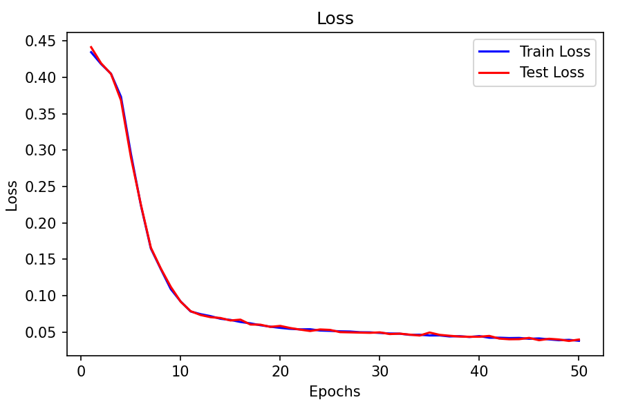
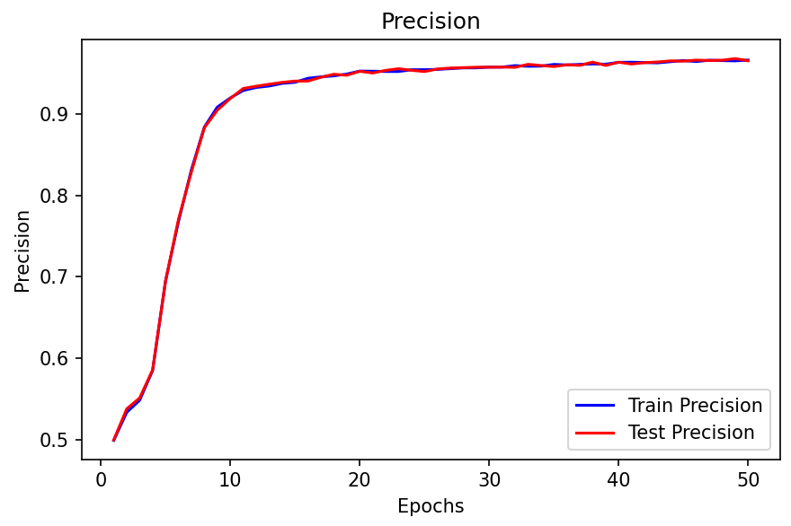
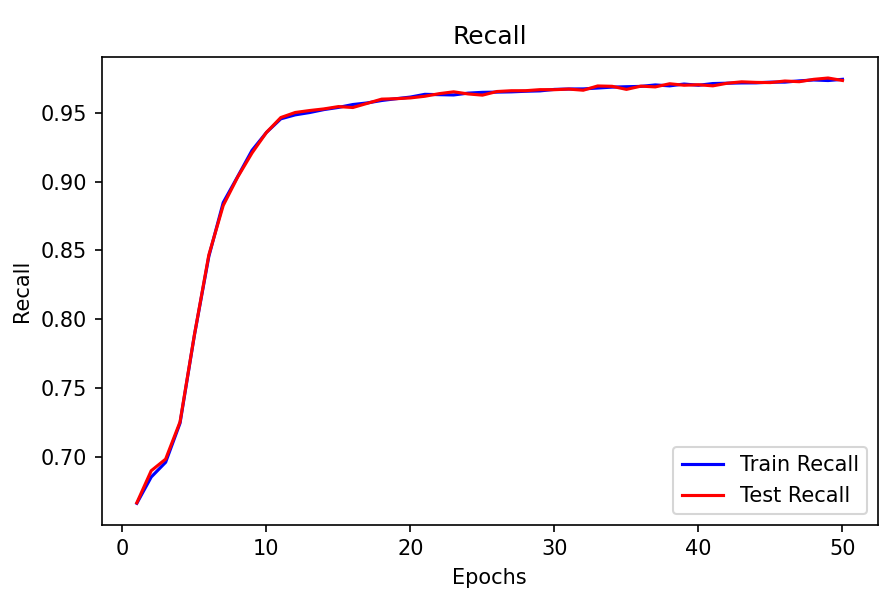
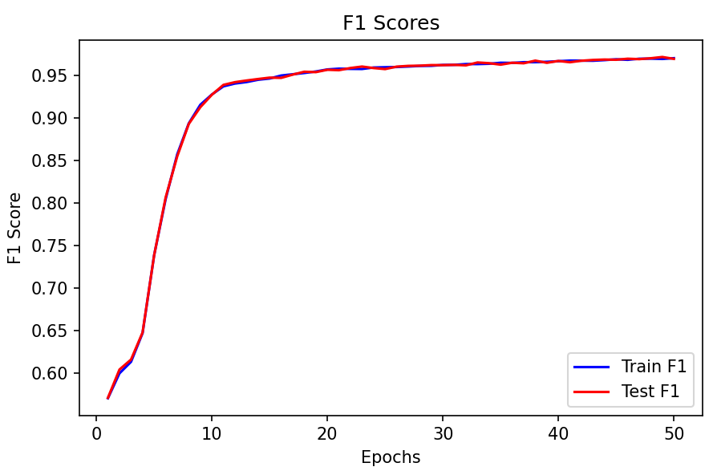

# 汉语词语自动切分方法的实现与分析

<center>
    2021K8009929010 贾城昊
</center>

[TOC]

## 一、报告摘要
1. 以北京大学标注的《人民日报》分词和词性标注语料，设计了双向最大匹配法（Bi-MM）， 基于CRF（条件随机场）的分词方法和基于bert的分词方法分别对汉语词语进行自动切分，并进行性能测试和分析。
2. 利用不同类型的网络文本测试上述三种的分词系统，对比分析分词方法和不同测试样本的性能变化。
3. 在上面得到的分词结果的基础上，实现子词压缩。
   
## 二、数据处理
### 1. 双向最大匹配法（Bi-MM）

对于双向最大匹配法（Bi-MM），数据处理较为简单，只需要使用Count库构建一个词典即可：
```python
def create_dictionary(self, data_path, encoding):
    with open(data_path, 'r', encoding=encoding) as f:
        words = f.read().split()

    word_count = Counter(words)

    word_dict = set()
    for word, count in word_count.most_common():
        word = word.split('/')[0]  # 提取词语
        if word.startswith('[') and len(word) > 1:  # 如果词语以"["开头，并且长度大于1
            word = word[1:]  # 去除左方括号
        word_dict.add(word)

    return word_dict
```

这部分代码详情请见代码文件`bi_MM.py`。

### 2. 基于CRF（条件随机场）的分词方法

CRF的数据处理相对而言麻烦一点，首先需要针对每个词，将其中每个字对应的label划分为 B、M、E、S 四种中的一个，表示词语的开始、中间、结束和单字。然后需要为句子中的每个字生成特征，然后将所有特征组合成一个特征列表用于训练：

```python
def transfer_dataset(self, file_path, encoding="gbk"):
    with open(file_path, 'r', encoding=encoding) as f:
        lines = f.readlines()

    bmes_data = []
    bmes_label = []

    for line in lines:
        words = line.split()
        words = [word.split('/')[0] for word in words]
        sentence = "".join(words)
        bmes_data.append(sentence)

        line_label = []
        for word in words:
            word = word.split('/')[0]
            if len(word) == 1:
                line_label.append('S')
            else:
                line_label.append('B')
                for char in word[1:-1]:
                    line_label.append('M')
                line_label.append('E')
        bmes_label.append(line_label)

    return bmes_data, bmes_label
```

上面的函数是返回的是语料中的句子列表和标签列表。

```python
def word2features(self, sent, i):
    word = sent[i][0]
    # 构造特征字典
    features = {
        'bias': 1.0,
        'word': word,
        'word.isdigit()': word.isdigit(),
    }
    # 该字的前一个字
    if i > 0:
        word1 = sent[i - 1][0]
        words = word1 + word
        features.update({
            '-1:word': word1,
            '-1:words': words,
            '-1:word.isdigit()': word1.isdigit(),
        })
    else:
        # 添加开头的标识 BOS(begin of sentence)
        features['BOS'] = True
    # 该字的前两个字
    if i > 1:
        word2 = sent[i - 2][0]
        word1 = sent[i - 1][0]
        words = word1 + word2 + word
        features.update({
            '-2:word': word2,
            '-2:words': words,
            '-3:word.isdigit()': word2.isdigit(),
        })
    # 该字的前三个字
    if i > 2:
        word3 = sent[i - 3][0]
        word2 = sent[i - 2][0]
        word1 = sent[i - 1][0]
        words = word1 + word2 + word3 + word
        features.update({
            '-3:word': word3,
            '-3:words': words,
            '-3:word.isdigit()': word3.isdigit(),
        })
    # 该字的后一个字
    if i < len(sent) - 1:
        word1 = sent[i + 1][0]
        words = word1 + word
        features.update({
            '+1:word': word1,
            '+1:words': words,
            '+1:word.isdigit()': word1.isdigit(),
        })
    else:
        # 句子的结尾添加对应的标识end of sentence
        features['EOS'] = True
    # 该字的后两个字
    if i < len(sent) - 2:
        word2 = sent[i + 2][0]
        word1 = sent[i + 1][0]
        words = word + word1 + word2
        features.update({
            '+2:word': word2,
            '+2:words': words,
            '+2:word.isdigit()': word2.isdigit(),
        })
    # 该字的后三个字
    if i < len(sent) - 3:
        word3 = sent[i + 3][0]
        word2 = sent[i + 2][0]
        word1 = sent[i + 1][0]
        words = word + word1 + word2 + word3
        features.update({
            '+3:word': word3,
            '+3:words': words,
            '+3:word.isdigit()': word3.isdigit(),
        })
    return features

def sent2features(self, sent):
    return [self.word2features(sent, i) for i in range(len(sent))]
```

这两个函数用于将句子中的每个字转换成特征表示。具体地，对于每个字，我设计了如下特征：
- bias: 偏置项，常数值 1.0。
- word: 当前字本身。
- word.isdigit(): 当前字是否为数字。

然后，对于当前字的上下文，还设计了一些额外的特征：
- 前一个字和当前字构成的字串。
- 前两个字、前三个字和当前字构成的字串。
- 后一个字和当前字构成的字串。
- 后两个字、后三个字和当前字构成的字串


这部分代码详情请见代码文件`CRF.py`。

### 3. 基于bert的分词方法

由于bert的输入输出不能是字符串，所以首先需要对使用tokenizer对输入的文本进行处理，得到每个token对应的ID，除此之外，还需要在得到BMES（开始、中间、结束、单个字）的label后，将其转化为实数。

需要注意的是，由于tokenizer会把特殊的标记（[CLS]和[SEP]）被添加到输入文本的开头和结尾，所以需要在每段文本的首位也加上特殊的label标记！

```python
class Bert_Dataset(Data.Dataset):
    def __init__(self, filename, lable2id, encoding="gbk", max_seq_len=512):
        self.max_seq_len = max_seq_len
        raw_texts, raw_labels = self.transfer_dataset(filename, encoding)
        self.labels = [[lable2id[element] for element in row] for row in raw_labels]

        tokenizer = AutoTokenizer.from_pretrained('bert-base-chinese')
        raw_texts = [split_numbers(text) for text in raw_texts]
        self.inputs = tokenizer(raw_texts, max_length=max_seq_len, is_split_into_words=False, return_length=True)
        self.len = len(self.labels)

        assert all(len(row1) == len(row2) for row1, row2 in zip(self.inputs["input_ids"], self.labels))
        assert all(len(row1) == len(row2) for row1, row2 in zip(self.inputs["token_type_ids"], self.labels))


    def transfer_dataset(self, file_path, encoding):
        with open(file_path, 'r', encoding=encoding) as f:
            lines = f.readlines()

        bmes_data = []
        bmes_label = []

        pattern = re.compile(r'\d{8}-\d{2}-\d{3}-\d{3}/\w')

        for line in lines:
            line = pattern.sub('', line)
            line = replace_full_width_numbers(line)
            words = line.split()
            words = [word.split('/')[0] for word in words]
            sentence = "".join(words)
            bmes_data.append(sentence)

            line_label = []
            line_label.append("0") #文本首尾加上特殊的标记
            for word in words:
                word = word.split('/')[0]
                if len(word) == 1:
                    line_label.append('S')
                else:
                    line_label.append('B')
                    for _ in word[1:-1]:
                        line_label.append('M')
                    line_label.append('E')

            line_label = line_label[:self.max_seq_len-1]
            line_label.append("0")
            bmes_label.append(line_label)

        return bmes_data, bmes_label

    def __len__(self):
        return self.len

    def __getitem__(self, index):
        return self.inputs["input_ids"][index], self.inputs['token_type_ids'][index], self.labels[index]
```

具体内容请见`dataset.py`。

而进行训练时，需要对数据集进行处理，将其转化为tensor形式，同时由于输入文本的长度不同会对模型的训练效果产生影响，需要对数据集进行padding，并得到对应的attention_mask，加快bert模型的推理过程，避免padding的数据占据了大量的计算资源。

```python
def collate_fn(batch_data, pad_token_id=0, pad_token_type_id=0, pad_label_id=0):
    input_ids_list, token_type_ids_list, attention_mask_list, label_list = [], [], [], []
    max_len = 0
    for input_ids, token_type_ids, labels in batch_data:
        input_ids_list.append(input_ids)
        token_type_ids_list.append(token_type_ids)
        label_list.append(labels)

        max_len = max(max_len, len(input_ids))

    for i in range(len(input_ids_list)):
        cur_len = len(input_ids_list[i])
        input_ids_list[i] = input_ids_list[i] + [pad_token_id] * (max_len - cur_len)
        token_type_ids_list[i] = token_type_ids_list[i] + [pad_token_type_id] * (max_len - cur_len)
        label_list[i] = label_list[i] + [pad_label_id] * (max_len - cur_len)
        attention_mask_list.append([1] * cur_len + [0] * (max_len - cur_len))

    return torch.tensor(input_ids_list), torch.tensor(token_type_ids_list), torch.tensor(label_list), torch.tensor(attention_mask_list)
```

然后与上次实验一样，每个epoch，会把数据集中随机的80%用作训练集，剩下20%用作数据集。这部分的主要代码如下：

```python
def get_loaders(label2id, batch_size=512, valid=0.0, train=0.8, filename="ChineseCorpus199801.txt",
                encoding="gbk", num_workers=0, pin_memory=False):
    file_path = "./datasets/bert_dataset.pth"
    if os.path.exists(file_path):
        dataset = torch.load(file_path)
    else:
        dataset = Bert_Dataset(filename=filename, lable2id=label2id, encoding=encoding)
        torch.save(dataset, file_path)
    
    train_size = int(train * len(dataset))
    test_size = len(dataset) - train_size
    trainset, testset = Data.random_split(dataset, [train_size, test_size])

    train_sampler, valid_sampler = get_train_valid_sampler(trainset, valid)
    train_loader = Data.DataLoader(trainset,
                              batch_size=batch_size,
                              sampler=train_sampler,
                              num_workers=num_workers,
                              pin_memory=pin_memory,
                              collate_fn=collate_fn)
    
    valid_loader = Data.DataLoader(trainset,
                              batch_size=batch_size,
                              sampler=valid_sampler,
                              num_workers=num_workers,
                              pin_memory=pin_memory,
                              collate_fn=collate_fn)
    
    test_loader = Data.DataLoader(testset,
                             batch_size=batch_size,
                             num_workers=num_workers,
                             pin_memory=pin_memory,
                             collate_fn=collate_fn)
    
    return train_loader, valid_loader, test_loader
```

其它相关代码可见`dataloader.py`。

## 三、模型实现

模型定义保存在`model/models.py`代码文件中

### 1. 双向最大匹配法（Bi-MM）

由于预处理已经得到了模型需要的字典，在预测阶段，只用分别对于输入的一段文本从左至右、以贪心的方式切分出当前位置上长度最大的词（正向最大匹配法 FMM）；对于输入的一段文本从右至左，以贪心的方式切分出当前位置上长度最大的词（逆向最大匹配法 BMM）。然后将正向最大匹配法得到的分词结果和逆向最大匹配法的到的结果进行比较：
- 如果正反向分词结果词数不同，则取分词数量较少的那个。
- 如果分词结果词数相同：分词结果相同，就说明没有歧义，可返回任意一个。分词结果不同，返回其中单字较少的那个。
具体代码如下：

```python
def forward_segment(self, text):
    text = text.strip()
    words_length = len(text)  # 统计序列长度
    # 存储切分好的词语
    cut_word_list = []
    while words_length > 0:
        max_cut_length = min(self.max_len, words_length)
        sub_text = text[0: max_cut_length]
        while max_cut_length > 0:
            if sub_text in self.dictionary:
                cut_word_list.append(sub_text)
                break
            elif max_cut_length == 1:
                cut_word_list.append(sub_text)
                break
            else:
                max_cut_length = max_cut_length - 1
                sub_text = sub_text[0:max_cut_length]
        text = text[max_cut_length:]
        words_length = words_length - max_cut_length
    return cut_word_list

def backward_segment(self, text):
    text = text.strip()
    words_length = len(text)  # 统计序列长度
    cut_word_list = []  # 存储切分出来的词语
    # 判断是否需要继续切词
    while words_length > 0:
        max_cut_length = min(self.max_len, words_length)
        sub_text = text[-max_cut_length:]
        while max_cut_length > 0:
            if sub_text in self.dictionary:
                cut_word_list.append(sub_text)
                break
            elif max_cut_length == 1:
                cut_word_list.append(sub_text)
                break
            else:
                max_cut_length = max_cut_length - 1
                sub_text = sub_text[-max_cut_length:]
        text = text[0:-max_cut_length]
        words_length = words_length - max_cut_length

    cut_word_list.reverse()
    return cut_word_list

def segment(self, text):
    bmm_word_list = self.backward_segment(text)
    fmm_word_list = self.forward_segment(text)
    bmm_word_list_size = len(bmm_word_list)
    fmm_word_list_size = len(fmm_word_list)
    if bmm_word_list_size != fmm_word_list_size:
        if bmm_word_list_size < fmm_word_list_size:
            return bmm_word_list
        else:
            return fmm_word_list
    else:
        FSingle = 0
        BSingle = 0
        isSame = True
        for i in range(len(fmm_word_list)):
            if fmm_word_list[i] not in bmm_word_list:
                isSame = False
            if len(fmm_word_list[i]) == 1:
                FSingle = FSingle + 1
            if len(bmm_word_list[i]) == 1:
                BSingle = BSingle + 1
        if isSame:
            return fmm_word_list
        elif BSingle > FSingle:
            return fmm_word_list
        else:
            return bmm_word_list
```

上面的segment方法就是对文本进行分词。
Bi-MM模型比较简单，所有的Bi-MM模型功能均被集成为一个类，更多的具体实现见`bi_MM.py`，这里不再赘述。

### 2. 基于CRF（条件随机场）的分词方法

基于CRF的分词方法使用了sklearn_crfsuite库，使用了L-BFGS算法（通过存储最近的几个梯度向量和参数变化量来构建一个近似的 Hessian 逆矩阵，然后使用这个近似的 Hessian 逆矩阵来计算下一步的参数更新方向）来优化 CRF 模型的参数。
代码如下：

```python
class CRFsModel:
    def __init__(self):
        self.crf = sklearn_crfsuite.CRF(
            algorithm='lbfgs',
            c1=0.1,
            c2=0.1,
            max_iterations=100,
            all_possible_transitions=True
        )
    
    def segment(self, texts):
        if not isinstance(texts, list):
            texts = [texts]

        datas = [self.sent2features(text) for text in texts]

        # 使用模型进行预测
        labels = self.crf.predict(datas)

        # 根据预测的标签进行分词
        predict_result = []
        for text, label in zip(texts, labels):
            words = []
            word = []
            for token, label in zip(text, label):
                if label == 'B':
                    if word:
                        words.append(''.join(word))
                        word = []
                    word.append(token)
                elif label == 'M':
                    word.append(token)
                elif label == 'E':
                    word.append(token)
                    words.append(''.join(word))
                    word = []
                else:
                    if word:
                        words.append(''.join(word))
                        word = []
                    words.append(token)

            predict_result.append(words)

        return predict_result
```

segment方法用于对文本进行分词。
所有的基于CRF的分词模型功能均被集成为一个类，更多的具体实现见`CRF.py`，这里不再赘述。

### 3. 基于bert的分词方法

基于bert的分词模型，则是在预训练的bert的基础上，添加了dropout层和全连接层，用于将bert模型的输出映射到不同的类别，然后使用交叉熵损失函数进行训练。
其中模型设置的代码如下：

```python
class BertForTokenClassification(nn.Module):
    def __init__(self, num_classes, droupout=None):
        super(BertForTokenClassification, self).__init__()
        self.num_classes = num_classes
        self.config = BertConfig.from_pretrained('bert-base-chinese', num_labels=5)
        self.bert = BertModel(self.config, add_pooling_layer=False)
        self.dropout = nn.Dropout(droupout if droupout is not None else self.bert.config["hidden_dropout_prob"])
        self.classifier = nn.Linear(self.bert.config["hidden_size"], num_classes)

    def forward(self, input_ids, token_type_ids=None, position_ids=None, attention_mask=None,):
        outputs = self.bert(input_ids=input_ids, token_type_ids=token_type_ids,position_ids=position_ids, attention_mask=attention_mask)
        sequence_output = outputs[0]
        sequence_output = self.dropout(sequence_output)

        logits = self.classifier(sequence_output)

        return logits
```

然后对于训练好的模型，进行分词时，也需要使用tokenizer将文本转化为id序列，得到模型输出后，进行argmax操作后，转化为BMES标签，得到分词结果，如下所示：

```python
def segment(self, text):
    id2label = {v: k for k, v in self.label2id.items()} # 标签id到标签的映射

    self.model.eval()
    tokenizer = AutoTokenizer.from_pretrained('bert-base-chinese')
    if not isinstance(text, list):
        raw_texts = [text]
    else:
        raw_texts = text

    encoded_inputs = tokenizer(raw_texts, max_length=512)
    input_ids = torch.tensor(encoded_inputs['input_ids']).cuda()
    token_type_ids = torch.tensor(encoded_inputs['token_type_ids']).cuda()

    outputs = self.model(input_ids=input_ids, token_type_ids=token_type_ids)
    logits = outputs.logits
    predictions = torch.argmax(logits, dim=-1).tolist()
    predictions = [[id2label[label_id] for label_id in raw[1:-1]] for raw in predictions]

    results = []
    for text, labels in zip(raw_texts, predictions):
        words = []
        word = []
        for token, label in zip(text, labels):
            if label == 'B':
                if word:
                    words.append(''.join(word))
                    word = []
                word.append(token)
            elif label == 'M':
                word.append(token)
            elif label == 'E':
                word.append(token)
                words.append(''.join(word))
                word = []
            else:
                if word:
                    words.append(''.join(word))
                    word = []
                words.append(token)

        results.append(words)

    return results
```

需要注意的是，由于tokenizer会把特殊的标记（[CLS]和[SEP]）被添加到输入文本的开头和结尾，所以对于模型输出的结果，也需要剔除开头和结尾的label（事实上，模型输出的首尾label也是特殊标记）。

基于bert的分词模型的训练的细节将会在第四部分进行具体讲解。模型的具体代码在`./model/bert_model.py`中。


## 四、实验过程
### 1. 训练与测试过程

对于Bi-MM模型，不需要进行训练，只需要用到预处理得到的词典即可。
对于CRF模型，则直接对预处理好的数据调用sklearn_crfsuite库中的函数进行训练即可。
```python
def train(self):
        self.crf.fit(self.train_data, self.train_label)
```
这里主要介绍基于bert的分词模型。

由于是对预训练的模型进行微调的过程，所以学习率不宜像上次一样设置过大，所以在训练过程中，首先以 `3e-5` 的学习率和 `16` 的 `batch_size`进行训练，使用Adam优化器与交叉熵损失，在数据集上训练了共`10`个epoch。

在训练完10个epoch后，发现loss较低且下降缓慢，此时在训练集和测试集上的正确率均接近了`90%`，然后进一步我以`3e-6` 的学习率又训练率40轮，得到最终的模型，最终的模型在训练集和测试集的正确率均可以到达`95%`的正确率。

对于训练的超参数配置，全部保存在`config/base.yaml`文件中，方便进行修改：

```yaml
lr : 3.0e-5
batch_size : 16
epochs : 20
label2id :
    "0": 0
    "B": 1
    "M": 2
    "E": 3
    "S": 4
```

在训练过程中，会记录下每个epoch的平均loss，预测准确率，recall和f1值
每个epoch，将自动保存一次模型参数到 `checkpoint/` 文件夹下，按 `bert-<epoch>.pth` 命名。下次训练时直接读取已保存的模型参数，以加快训练速度。默认时加载epoch最新的模型数据，如下所示（大部分代码进行了省略）：

```python
class Model_Pipline():
    def __init__(self, config, device="cuda", load_path=None, row_filename="ChineseCorpus199801.txt"):
        self.filename = row_filename

        cuda_availdabe = torch.cuda.is_available()
        if cuda_availdabe and device != "cpu":
            print('Initializing model on GPU')
        else:
            print('Initializing model on CPU')

        # 超参数
        self.epochs = config["epochs"]
        self.batch_size = config["batch_size"]
        self.lr = config["lr"]
        self.label2id = config["label2id"]

        bert_config = BertConfig.from_pretrained('bert-base-chinese', num_labels=5)
        self.model = BertForTokenClassification(bert_config)

        if cuda_availdabe and device != "cpu":
            self.model.cuda()

        if load_path is not None:
            self.model.load_state_dict(load_path)

    def train_or_eval(self, loss_function, dataloader, optimizer=None, train=False):
        ...

        return avg_loss, avg_precision, avg_recalls, avg_f1

    def train(self, optimizer=None, loss_function=None):
        ···
        pth_list = os.listdir("checkpoint")
        latest_pth = None
        cumulative_epoch = 0
        for pth in pth_list:
            if pth.endswith(".pth"):
                if latest_pth is None:
                    latest_pth = pth
                else:
                    current_id = int(pth.split("-")[-1].split(".")[0])
                    latest_id = int(latest_pth.split("-")[-1].split(".")[0])
                    if current_id > latest_id:
                        latest_pth = pth
                        cumulative_epoch = current_id

        if latest_pth is not None:
            print("load model from checkpoint/" + latest_pth)
            self.model.load_state_dict(torch.load("checkpoint/" + latest_pth))
        ···

        train_losses, train_accuracy, test_losses, test_accuracy = [], [], [], []
        pbar = tqdm(range(self.epochs), desc="Training Progress")
        for _ in pbar:
            ···

            cumulative_epoch += 1
            if cumulative_epoch % 1 == 0:
                if not os.path.exists('checkpoint'):
                    os.makedirs('checkpoint')
                torch.save(self.model.state_dict(), "./checkpoint/Bert-" + str(cumulative_epoch) + ".pth")

        ···

        return train_losses, train_accuracy, train_recalls，train_recalls，
                test_losses, test_accuracy，test_recalls，test_recalls

    def test(self, dataloader=None, loss_function=None):
        pth_list = os.listdir("checkpoint")
        latest_pth = None
        for pth in pth_list:
            if pth.endswith(".pth"):
                if latest_pth is None:
                    latest_pth = pth
                else:
                    current_id = int(pth.split("-")[-1].split(".")[0])
                    latest_id = int(latest_pth.split("-")[-1].split(".")[0])
                    if current_id > latest_id:
                        latest_pth = pth

        if latest_pth is not None:
            print("load model from checkpoint/" + latest_pth)
            self.model.load_state_dict(torch.load("checkpoint/" + latest_pth))

        ···

        return test_losses, test_accuracy，test_recalls，test_recalls

    ··· 
```

模型的训练和测试代码在`main.py`中，可以通过添加参数进行对应的配置：
```python
if __name__ == "__main__":
    parser = argparse.ArgumentParser(description='The setting of bert model')
    parser.add_argument('--train', type=str, default=True, help='train or not')
    parser.add_argument('--config', type=str, default="./config/base.yaml", help='config file')
    parser.add_argument('--device', type=str, default="cuda", help='the device to train or test the model')
    args = parser.parse_args()
```

### 2. 超参数（batch_size）调整过程

在具体训练时，最初由于自己电脑GPU的限制（3060），导致`batch_size`只能设置为`4`，否则GPU的内存会不够，但显然过小的batch_size不仅导致了训练较慢，而且也会严重影响模型的收敛性，所以最初我训练了`30`个`epoch`，在训练和测试集上的正确率仍然只有`57%`，效果很差。

所以为了解决计算资源的限制，我使用了在计算所VIPL实习时分配到的服务器进行训练，并把`batch_size`设置为了`16`。最终模型的loss收敛极快，且最后能到达`95%`的正确率，模型的效果也很好!

### 3. Loss，Accuracy，recall，f1-score的曲线图

在训练的过程中，我记录下了每个epoch在训练集和测试集的Loss，Accuracy，recall，f1-score，并绘制了曲线图。如下所示：

<center>


图1 - Loss


图2 - Precision


图3 - Recall


图3 - F1-score

</center>

注： 由于后面训练的学习率与前面的不一样，所以变化的陡峭程度会有一定区别

## 五. 子词压缩
子词压缩在中文分词的基础上使用了BPE算法，BPE 算法的核心思想是通过逐步合并出现频率最高的字符对（字节对）来生成词汇表，从而实现对文本的划分，由于其并不是直接对单词划分，其可以很好的学习到句子中前缀与后缀的含义。主要步骤如下：

1. 构建词表：
- 确定词表大小，即subword的最大个数V；
- 在每个单词最后添加一个</w>，并且统计每个单词出现的频率；
- 将所有单词拆分为单个字符，构建出初始的词表，此时词表的subword其实就是字符；
- 挑出频次最高的字符对，比如说t和h组成的th，将新字符加入词表，然后将语料中所有该字符对融合（merge），即所有t和h都变为th。新字符依然可以参与后续的merge，有点类似哈夫曼树，BPE 实际上就是一种贪心算法；
- 重复3，4的操作，直到词表中单词数量达到预设的阈值V或者下一个字符对的频数为1；

这部分代码如下：
```python
def get_vocab(self, texts: list) -> None:
    # 基础分词，获取词表
    self.vocab = defaultdict(int)
    for text in texts:
        for word in text:
            # 分割成字符并在结尾加上终止符
            word = ' '.join(list(word)) + ' </w>'
            self.vocab[word] += 1

def get_stats(self):
    pairs = defaultdict(int)
    for word, freq in self.vocab.items():
        symbols = word.split()
        for i in range(len(symbols)-1):
            pairs[symbols[i], symbols[i+1]] += freq

    return pairs

def merge_vocab(self, pair):
    bigram = re.escape(' '.join(pair)) #转义空格
    pattern = re.compile(r'(?<!\S)' + bigram + r'(?!\S)') #只匹配单词的开头或者空格后的字符对
    new_vocab = defaultdict(int)
    for word in self.vocab:
        w_out = pattern.sub(''.join(pair), word)
        new_vocab[w_out] += self.vocab[word]

    return new_vocab

def bpe_vocab(self, num_merges):
    if self.vocab is None:
        self.get_vocab(self.texts)

    for _ in range(num_merges):
        pairs = self.get_stats()
        if not pairs:
            break
        best = max(pairs, key=pairs.get)
        #if pairs[best] == 1:
            #break
        self.vocab = self.merge_vocab(best)

def get_tokens(self):
    self.tokens = defaultdict(int)
    for word, freq in self.vocab.items():
        word_tokens = word.split()
        for token in word_tokens:
            self.tokens[token] += freq
    return self.tokens
```
之所以在每个单词最后添加一个</w>，是为了保证subword作为前缀和后缀的含义不一样，而且保证了subword不会跨分词进行分割。

2. BPE编码
词表构建完成后，需要对训练语料进行编码，编码流程如下：
- 将词表中的单词按长度大小，从长到短就行排序；
- 对于语料中的每个单词，遍历排序好的词表，判断词表中的单词/子词（subword）是否是该字符串的子串，如果匹配上了，则输出当前子词，并继续遍历单词剩下的字符串。
- 如果遍历完词表，单词中仍然有子字符串没有被匹配，那我们将其替换为一个特殊的子词，比如<unk>。

这部分代码如下：
```python
def segment(self, sentences):
    dic = []
    for key in self.tokens.keys():
        key.replace("\w", "")
        if key not in dic:
            dic.append(key)

    results = []
    for sentence in sentences:
        try:
            sentence = self.model.segment(sentence)[0]
            sentence = "".join(sentence)
        except:
            sentence = self.model.segment(sentence)
            sentence = "".join(sentence)

        segment_tools = BiMM(dictionary=dic)
        results.append(segment_tools.segment(sentence))

    return results
```

这里直接使用了BiMM库，这是因为最后的编码（划分）过程与双向匹配较为相似，可以直接调用（注：若按照标准流程划分，其实应该对输入的文本加上`\w`，然后使用原本的词表进行划分，针对这种处理，也写了一个函数：

```python
def segment_w(self, sentences):
    results = []
    for sentence in sentences:
        try:
            sentence = [text+'</w>' for text in self.model.segment(sentence)[0]]
            sentence = "".join(sentence)
        except:
            sentence = [text+'</w>' for text in self.model.segment(sentence)]
            sentence = "".join(sentence)
        segment_tools = BiMM(dictionary=self.tokens.keys())
        results.append(segment_tools.segment(sentence))

    return results
```

这样就强制要求使用一个中文分词的model。

3. BPE解码
语料解码就是将所有的输出子词拼在一起，直到碰到结尾为`<\w>`。
代码如下：
```python
def bpe_decode(self, sentences):
    results = []
    for sentence in sentences:
        if isinstance(sentence, list):
            sentence = "".join(sentence)

        decoded_text = []
        word = ""
        for char in sentence:
            if char == "<":  # 开始一个新的词或子词
                if word:  # 如果之前的词不为空，将其加入解码文本中
                    decoded_text.append(word)
                word = ""
            elif char == ">" or char == "w" or char == "/":
                continue
            else:
                word += char  # 继续构建当前词
        if word:  # 如果最后一个词不为空，将其加入解码文本中
            decoded_text.append(word)

        results.append(decoded_text)

    return decoded_text
```

所有的BPE相关函数集成到了一个类，代码在`BPE.py`中，并且通过config可以选择基于的分词模型。

## 六. 实验结果
### 1. 分词模型效果验证

为了验证模型的分词效果，本人挑选了几种类型的句子进行测试，分别代表了人民日报用语，生活用语，含有特殊名词，存在划分歧义的情况，如下
```python
texts = ["党中央和国务院高度重视高校毕业生等青年就业创业工作。要深入学习贯彻总书记的重要指示精神，更加突出就业优先导向，千方百计促进高校毕业生就业，确保青年就业形势总体稳定。",
                "好久不见！今天天气真好，早饭准备吃什么呀？",
                "我特别喜欢去北京的天安门和颐和园进行游玩",
                "中国人为了实现自己的梦想",
                "《原神》收入大涨，腾讯、网易、米哈游位列中国手游发行商全球收入前三"]
```

其中第一句话是从5月15日的人民日报截取的一句话，第二句则是一句日常打招呼的用语，第三句包含了天安门，颐和园等专业名词，第四句则是PPT给出的一个存在划分歧义的句子。针对专有名词，考虑到有可能语料库中含有`天安门`和`颐和园`，所以我从最近百度热搜中挑选了一个包含语料库中不可能含有的专有名词的句子，也就是上面的第五个句子。

双向最大匹配法（Bi-MM）的输出如下所示：
```bash
党中央/和/国务院/高度/重视/高校/毕业生/等/青年/就业/创业/工作/。/要/深入/学习/贯彻/总书记/的/重要/指示/精神/，/更加/突出/就业/优先/导向/，/千方百计/促进/高校/毕业生/就业/，/确保/青年/就业/形势/总体/稳定/。
好久/不见/！/今天/天气/真/好/，/早饭/准备/吃/什么/呀/？
我/特别/喜欢/去/北京/的/天安门/和/颐和园/进行/游玩
中/国人/为了/实现/自己/的/梦想
《/原/神/》/收入/大/涨/，/腾/讯/、/网/易/、/米/哈/游/位/列/中/国手/游/发行/商/全球/收入/前/三
```

基于CRF（条件随机场）的分词模型的输出如下所示：
```bash
党中央/和/国务院/高度/重视/高校/毕业生/等/青年/就业/创业/工作/。/要/深入/学习/贯彻/总书记/的/重要/指示/精神/，/更加/突出/就业/优先/导向/，/千方百计/促进/高校/毕业生/就业/，/确保/青年/就业/形势/总体/稳定/。
好久不见/！/今天/天气/真/好/，/早饭/准备/吃/什么/呀/？
我/特别/喜欢/去/北京/的/天安门/和/颐和园/进行/游玩
中国/人/为了/实现/自己/的/梦想
《/原神/》/收入/大涨/，/腾讯/、/网易/、/米哈游/位列/中国/手游/发行商/全球/收入/前/三
```
    
基于bert的分词模型给出的输出如下所示：
```bash
党中央/和/国务院/高度/重视/高校/毕业生/等/青年/就业/创业/工作/。/要/深入/学习/贯彻/总书记/的/重要/指示/精神/，/更加/突出/就业/优先/导向/，/千方百计/促进/高校/毕业生/就业/，/确保/青年/就业/形势/总体/稳定/。
好久不见/！/今天/天气/真/好/，/早饭/准备/吃/什么/呀/？
我/特别/喜欢/去/北京/的/天安门/和/颐和园/进行/游玩
中国人/为了/实现/自己/的/梦想
《/原神/》/收入/大涨/，/腾讯/、/网易/、/米哈游/位列/中国/手游/发行商/全球/收入/前/三
```

可以看到，由于语料库是针对人民日报的语料进行训练的，所以对于从人民日报截取的句子的划分效果较好。而生活用语和含有语料库存在的专有名词的句子三种模型也均能进行正确划分。

但是针对含有划分歧义的句子（第四句）和含有语料库中不存在的专有名字的句子（第五句），双向匹配法明显就划分错误，但是基于crf和基于bert的分词模型均进行了正确的划分。这也在预料之中，因为双向匹配模型算法过于简单，很难处理复杂的句子。

同时对于crf和bert的结果，在第五句出现了差别，crf把`中国人`进行了划分，而bert则没有进行划分。很明显，bert的效果较crf则更进了一步

综上，基于crf和基于bert的分词模型的效果均较好。而且，由于bert模型在训练集和测试集上的正确率均能到达95%，个人认为，如果持续增加语料，基于bert的分词模型能够处理几乎所有的句子！

### 2. 子词压缩效果验证

基于bert模型，对`texts`中的进行了验证，其中BPE的词表大小为1000000。得到的效果如下：
```bash
党中央/和/国务院/高度/重视/高校/毕业生/等/青年/就业/创业/工作/。/要/深入/学习/贯彻/总书记/的/重要/指示/精神/，/更加/突出/就业/优先/导向/，/千方百计/促进/高校/毕业生/就业/，/确保/青年/就业/形势/总体/稳定/。
好久/不见/！/今天/天气/真/好/，/早饭/准备/吃/什么/呀/？
我/特别/喜欢/去/北京/的/天安门/和/颐和园/进行/游玩
中国/人/为了/实现/自己/的/梦想
《/原/神/》/收入/大/涨/，/腾/讯/、/网/易/、/米/哈/游/位列/中国/手游/发行/商/全球/收入/前/三
```

可以看到，子词划分将`中国/人`划分成了`中国/人`，这是因为语料中`中国`出现较多而`中国人`相对较少，所以其认为这是一个前缀而进行了划分，而其它同理。

若对输入文本加上`<\w>`，则效果如下：
```bash
党中央<\w>/和<\w>/国务院<\w>/高度<\w>/重视<\w>/高校<\w>/毕业生<\w>/等<\w>/青年<\w>/就业<\w>/创业<\w>/工作<\w>/。<\w>/要<\w>/深入<\w>/学习<\w>/贯彻<\w>/总书记<\w>/的<\w>/重要<\w>/指示<\w>/精神<\w>/，<\w>/更加<\w>/突出<\w>/就业<\w>/优先<\w>/导向<\w>/，<\w>/千方百计<\w>/促进<\w>/高校<\w>/毕业生<\w>/就业<\w>/，<\w>/确保<\w>/青年<\w>/就业<\w>/形势<\w>/总体<\w>/稳定<\w>/。<\w>
好久/不见<\w>/！<\w>/今天<\w>/天气<\w>/真<\w>/好<\w>/，<\w>/早饭<\w>/准备<\w>/吃<\w>/什么<\w>/呀<\w>/？<\w>
我<\w>/特别<\w>/喜欢<\w>/去<\w>/北京<\w>/的<\w>/天安门<\w>/和<\w>/颐和园<\w>/进行<\w>/游玩<\w>
中国/人<\w>/为了<\w>/实现<\w>/自己<\w>/的<\w>/梦想<\w>
《<\w>/原/神<\w>/》<\w>/收入<\w>/大/涨<\w>/，<\w>/腾/讯<\w>/、<\w>/网/易<\w>/、<\w>/米/哈/游<\w>/位列<\w>/中国<\w>/手游<\w>/发行/商<\w>/全球<\w>/收入<\w>/前<\w>/三<\w>
```
对其进行解码，便得到bert模型的分词输出：
```bash
党中央/和/国务院/高度/重视/高校/毕业生/等/青年/就业/创业/工作/。/要/深入/学习/贯彻/总书记/的/重要/指示/精神/，/更加/突出/就业/优先/导向/，/千方百计/促进/高校/毕业生/就业/，/确保/青年/就业/形势/总体/稳定/。
好久不见/！/今天/天气/真/好/，/早饭/准备/吃/什么/呀/？
我/特别/喜欢/去/北京/的/天安门/和/颐和园/进行/游玩
中国人/为了/实现/自己/的/梦想
《/原神/》/收入/大涨/，/腾讯/、/网易/、/米哈游/位列/中国/手游/发行商/全球/收入/前/三
```

## 七、文件结构

```plain
.
|   bert.py                             # bert模型训练与测试代码
|   bi_MM.py                            # bi_MM模型训练与测试代码
|   BPE.py                              # 子词压缩BPE代码
|   ChineseCorpus199801.txt             # 北京大学人民日报语料
|   CRF.py                              # CRF模型训练与测试代码
|   dataloader.py                       # bert模型数据集加载代码
|   dataset.py                          # bert模型数据集构建代码
|   Readme.md                           # 技术报告markdown版本
|   Readme.pdf                          # 技术报告PDF版本
|   record.py                           # bert模型训练结果与过程的记录与可视化        
|   training_results_bert.txt           # bert模型训练过程记录文件
|
+---checkpoint                          # *模型训练结果存放文件夹*
|       Bert-1.pth              
|       ···
|       Bert-50.pth
|       biMM_dic.joblib
|       crf_model.joblib
|
+---config
|       base.yaml                       # bert分词模型的配置文件
|
+---datasets
|       bert_dataset.pth                # *bert分词模型的数据集*
|
+---image                               # for Readme.md
|       F1-Score.png
|       Loss.png
|       Precision.png
|       Recall.png
|
\---model                               # bert模型定义
        bert_model.py
```

注：带有*号的文件为程序运行的结果，由于助教表示不要提交数据集和模型训练结果，所以部分文件没有提交，如果需要，可以去
[我的github仓库](https://github.com/Jia040223/NLP)：https://github.com/Jia040223/NLP 上下载。


